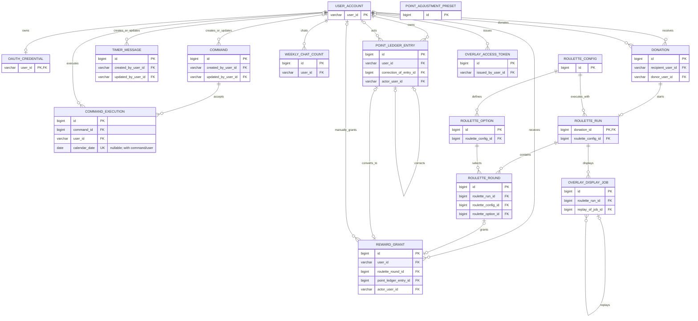
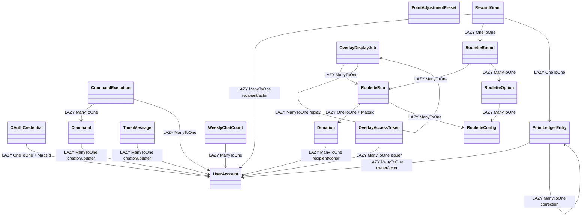

# Canonical database redesign

이 문서는 `nyang-nyang-bot`의 레거시 없는 최종 데이터 모델과 마이그레이션 경계를 정의한다.
실행 가능한 Flyway `V7`~`V10`과 Java migration을 구현했으며, 최종 물리 스키마 명세는
[`target-schema.sql`](./target-schema.sql), MariaDB 불변성 명세는
[`target-invariants.sql`](./target-invariants.sql), 현행 DB 사전점검 쿼리는
[`migration-preflight.sql`](./migration-preflight.sql)을 기준으로 한다.

## 확정 원칙

- 최종 업무 테이블은 16개이며 기존 `favorite`, `upbo`, `roulette_event`,
  `authorization_account` 명칭을 남기지 않는다.
- `user_account.user_id`는 CHZZK 사용자 식별자 자체를 PK로 사용한다.
- 사용자 ID는 공백 제거·대소문자 변환 없이 원문 바이트를 보존하고, 뒤 공백도
  구분하는 `utf8mb4_nopad_bin`으로 비교한다. 서로 다른 원문이 trim/case/Unicode collation에서만
  같아지는 경우 자동 병합하지 않고 컷오버를 중단한다.
- 단일 부모와 생명주기를 공유하는 1:1 상태는 shared PK를 사용한다.
- 복합 업무키가 필요한 독립 행은 `BIGINT` PK와 업무 `UNIQUE`를 함께 둔다.
- 모든 FK는 Flyway DDL이 소유한다. JPA 연관관계는 자식에서 부모로 향하는 단방향
  `LAZY` ToOne을 기본으로 한다.
- 부모에서 자식으로 탐색하는 실제 유스케이스가 있으면 양방향 또는 ToMany를 추가할 수
  있다. FK를 가진 자식 측을 연관관계 주인으로 유지하고 부모 측은 `mappedBy` 역방향으로
  매핑하며 기본 fetch는 `LAZY`로 둔다.
- `CascadeType`은 함께 전파해야 하는 operation만 선택하고, `orphanRemoval`은 부모에
  완전히 종속되어 생명주기를 공유하는 자식에만 사용한다. 이런 예외는 쿼리 수와
  저장·변경·삭제 결과, Flyway FK 삭제 규칙과의 호환성을 통합 테스트한다.
- 룰렛 설정과 옵션은 활성화 이후 불변이다. 변경은 새 `roulette_config`와
  `roulette_option` 집합을 생성해 교체한다.
- MariaDB trigger가 non-DRAFT 룰렛 설정/옵션의 UPDATE·DELETE와 포인트 원장의
  UPDATE·DELETE를 차단하고 run/round의 설정·추첨 사실과 삭제를 보호한다.
  애플리케이션 검증만으로 불변성을 주장하지 않는다.
- `roulette_run`과 `roulette_round`에는 설정/옵션 JSON 또는 표시값 스냅샷을
  저장하지 않는다.
- OAuth access/refresh token은 현재 결정대로 평문 저장한다. 애플리케이션 로그,
  API 응답, 예외 메시지에는 절대 노출하지 않는다.
- 모든 테이블과 컬럼 설명은 실제 DB `COMMENT`로 관리한다. 별도 `description`
  컬럼은 업무 데이터일 때만 사용한다.
- 명령 실행 이력은 애플리케이션에서 append-only로 기록한다. 카운트 초기화는 운영자가
  `command_execution` 행을 DB에서 직접 삭제해 수행하며, 관리 화면과 초기화 이력은
  이번 모델에 포함하지 않는다. 같은 이벤트에서 count·쿨다운·streak를 모두 파생하므로
  삭제는 세 결과를 함께 되돌린다.

## 16개 테이블

| 영역 | 테이블 | 역할 |
|---|---|---|
| 사용자 | `user_account` | 공통 CHZZK 사용자, 현재 표시 이름, 관리자 여부 |
| 인증 | `oauth_credential` | 사용자별 OAuth 자격 증명 |
| 명령 | `command` | 사용자 정의 채팅 명령 |
| 명령 | `command_execution` | 승인된 사용자 명령 실행 이벤트 |
| 타이머 | `timer_message` | 타이머 설정과 원자적 선점 상태 |
| 포인트 | `point_ledger_entry` | 불변 포인트 원장 |
| 포인트 | `point_adjustment_preset` | 관리자 조정 프리셋 |
| 채팅 | `weekly_chat_count` | 서울 기준 주간 채팅 집계 |
| 후원 | `donation` | CHZZK 후원 소켓 프레임의 로컬 수신 사실 |
| 룰렛 | `roulette_config` | 불변 룰렛 설정 버전 |
| 룰렛 | `roulette_option` | 설정 버전에 속한 불변 옵션 |
| 룰렛 | `roulette_run` | 후원당 하나의 룰렛 실행 |
| 룰렛 | `roulette_round` | 실행의 개별 추첨 회차 |
| 보상 | `reward_grant` | 사용자에게 실제 지급된 보상 |
| 오버레이 | `overlay_access_token` | 원문을 저장하지 않는 접근 토큰 해시 |
| 오버레이 | `overlay_display_job` | 원자적으로 선점하는 표시 작업 |

## 테이블 최소화 재점검

`attendance_streak`, `daily_attendance`, `point_account`, `command_count`,
`user_command_count`, `reward_template`을 제거한다. 명령 실행이라는 하나의 사실을
`command_execution`에 기록하고 전체/사용자별 count와 일일 명령의 current/longest
streak를 여기서 파생한다. 아직 streak 전용 조회·랭킹 요구가 없으므로 별도 캐시의
동시 갱신과 복구 비용을 부담하지 않는다. 실제 부하가 확인될 때 읽기 모델이나
disposable cache를 추가한다.

포인트 잔액도 `point_ledger_entry.delta`의 합계가 정본이다. `point_account`와 원장별
누적값 `balance_after`를 함께 제거한다. 현재 잔액은 `(user_id, created_at, id)` 인덱스의
원장 행을 `SUM(delta)`로 직접 계산한다. AUTO_INCREMENT ID는 commit 순서를 보장하지
않으므로 최신 원장 ID를 cache version으로 사용하지 않는다. 실제 부하가 확인되고
commit 순서를 반영하는 version 또는 무효화 수단이 마련되기 전에는 애플리케이션
잔액 캐시도 두지 않는다.

명령 전체/사용자별 카운트는 `command_execution`을 DB에서 `COUNT(*)`로 집계한다.
이벤트를 애플리케이션으로 전부 읽어 합산하지 않는다. 명령 실행마다 값이 바뀌어
캐시 적중률이 낮으므로 우선 인덱스 집계로 운영한다. `reward_template`은 production
input adapter가 없고 지급 사실이 `reward_grant`에 완결되므로 미참조 catalog 행 수만
기록하고 폐기한다.
단, `user_upbo.upbo_template_id`가 한 건이라도 존재하면 지급 출처 provenance가
사라지므로 preflight가 컷오버를 중단하고 target 설계를 다시 결정한다.

나머지 16개 테이블은 다음 독립 책임 중 하나를 소유하므로 유지한다.

| 테이블 | 유지 이유 |
|---|---|
| `user_account`, `oauth_credential` | 공통 사용자 정본과 인증 비밀의 생명주기·보안 경계가 다름 |
| `command`, `command_execution` | 명령 설정과 승인된 실행 사실을 분리하고 count·쿨다운·streak를 같은 이벤트에서 파생 |
| `timer_message` | 설정과 원자적 실행 선점 상태를 소유 |
| `point_ledger_entry` | 포인트 증감·원인·멱등성·정정의 불변 정본이며 현재 잔액도 여기서 계산 |
| `point_adjustment_preset` | 현재 관리자 조정 UI가 실제로 사용하는 지속 설정 |
| `weekly_chat_count` | 서울 기준 주간 랭킹 집계의 업무 유일성을 소유 |
| `donation`, `roulette_config`, `roulette_option` | 로컬 후원 수신 사실과 불변 룰렛 설정 버전을 분리 |
| `roulette_run`, `roulette_round` | 후원별 회차 집합 확정과 N개 추첨·개별 보상 처리 상태를 분리 |
| `reward_grant` | 템플릿 없는 수동 지급까지 포함하는 실제 지급 사실 |
| `overlay_access_token`, `overlay_display_job` | 접근 인증과 replay 가능한 lease 기반 표시 큐의 생명주기가 다름 |

`command_execution`은 현행 runtime에 없는 신규 요구이며 빈 상태로 시작한다. 현행
`AttendanceService`는 관리자가 임의 시점의 채팅 생존자를 골라 포인트를 주는 기능이다.
사용자가 직접 실행하는 일별 출석은 `USER_CALENDAR_DAY` 정책을 가진 일반 명령이고,
포인트 지급과 다른 도메인이다. 따라서 legacy `ATTENDANCE` 포인트 원장을 실행 이력으로
변환하지 않는다.
수동 보상은 template 선택 대신 지급 시점의 label/type/mode/point/description을
`reward_grant`에 직접 기록한다.

CHZZK 공식 DONATION 소켓 payload에는 후원 이벤트 ID나 발생 시각이 없다. 신규 수신은
프레임을 받을 때 `chzzk-received:<UUID>` 형태의 `ingestion_key`를 만들고, 같은 로컬
수신을 애플리케이션 내부에서 재처리할 때만 이 키로 멱등성을 보장한다. payload hash는
내용이 같은 정상 후원을 합칠 수 있으므로 사용하지 않는다. 따라서 `donation`은 외부
제공자의 전역 exactly-once 정본이 아니며, 연결 재수립 등으로 공급자가 동일 프레임을
다시 보내는 경우까지 중복 제거한다고 주장하지 않는다. 레거시 `donation_event_id`는
기존 행의 `ingestion_key`로 그대로 보존한다.

## 명령 실행·카운트·일일 streak 모델

쿨다운 판정은 global이 아니라 `(command_id, user_id)`별 정책이다. 같은 사용자의 다른
명령과 다른 사용자의 같은 명령은 서로의 쿨다운 시간을 공유하지 않는다. 다만 승인
트랜잭션은 동시성 안전성을 위해 같은 command 또는 user 잠금을 짧게 직렬화한다.

- `USER_INTERVAL`: 마지막 승인 시각부터 `user_cooldown_seconds`가 지난 뒤 다시 승인한다.
  `calendar_date`는 NULL이고 같은 사용자·명령의 이벤트를 여러 건 저장한다.
- `USER_CALENDAR_DAY`: `user_cooldown_seconds`는 NULL이고 승인 시점의
  `Asia/Seoul` 날짜를 저장한다. `UNIQUE(command_id, user_id, calendar_date)`가 같은
  날의 두 번째 승인을 차단한다.

`command_execution.execution_policy_snapshot`과 `cooldown_seconds_snapshot`은 mutable
command의 현재 설정이 아니라 실제 승인에 사용한 정책을 보존한다. trigger token,
template, nickname, args snapshot과 count/streak 캐시 컬럼은 저장하지 않는다.
`executed_at`과 `calendar_date`는 DB가 반환한 동일한 승인 `Instant`에서 각각 UTC와
`Asia/Seoul`로 계산하며 upstream 채팅 시각을 사용하지 않는다.

- 전체 count: 현재 이벤트 insert 뒤 `command_id`로 `COUNT(*)`
- 사용자 count: 현재 이벤트 insert 뒤 `command_id`, `user_id`로 `COUNT(*)`
- 일일 실행일: 같은 command/user의 non-NULL `calendar_date`
- longest streak: 일일 실행일 중 가장 긴 연속 날짜 구간
- current streak: 마지막 실행일이 서울 기준 오늘 또는 어제이면 마지막 연속 구간 길이,
  그보다 오래되었으면 0

같은 command ID에서 trigger/template/policy를 바꾸면 누적 count는 이어진다. interval에서
일일 정책으로 전환한 당일에는 첫 일일 실행이 가능하고, 이미 같은 날 일일 실행 이력이
있으면 다른 정책을 거쳐 돌아와도 재실행은 차단된다. 새 command ID를 만들면 별개의
count와 streak가 시작된다.

운영 초기화는 승인 경로와 같은 순서로 command 행을 `PESSIMISTIC_WRITE`로 잠근 한
트랜잭션에서 command를 비활성화하고, 명령 전체면 `command_id`, 특정 사용자면
`command_id + user_id` 조건으로 행을 삭제한 뒤 commit한다. 기존 승인은 command 잠금
앞에서 먼저 끝나므로 그 이벤트까지 삭제되고, 새 승인은 commit 뒤 비활성 상태를 읽어
중단된다. 초기화 후 재활성화는 별도 명시적 작업이다. 이 삭제는 count뿐 아니라 해당
행에 근거한 최근 쿨다운과 일일 streak도 함께 초기화하므로 범위를 먼저 조회한다. 별도
숫자만 고치는 UPDATE는 허용하지 않는다.

## 물리 DB 관계도

아래 다이어그램은 FK 방향과 주요 키만 표시한다. 전체 컬럼, 타입, 인덱스,
CHECK와 삭제 규칙은 `target-schema.sql`이 기준이다.

## JPA 엔티티 관계도

현재 목표 모델에는 부모에서 자식으로 탐색해야 하는 요구가 없어 자식 컬렉션을 두지
않는다. 목록·집계 화면은 repository projection, 명시적 join 또는 fetch join으로 읽는다.
향후 구체적인 탐색·변경 요구가 생기면 양방향 또는 ToMany 연관을 추가할 수 있다.

Shared PK `@MapsId`는 정확히 두 곳이다.

1. `OAuthCredential.userId -> UserAccount.userId`
2. `RouletteRun.donationId -> Donation.id`

`CommandExecution`, `WeeklyChatCount`는 복합 PK 대신 각각 `BIGINT id`를 PK로 둔다.
`(command_id, user_id, calendar_date)`, `(week_start_date, user_id)`는 업무
`UNIQUE`로 보존한다. MariaDB UNIQUE가 여러 NULL을 허용하므로 interval 실행의
`calendar_date=NULL` 행은 계속 쌓이고, 일일 정책의 non-NULL 날짜만 하루 한 건으로
제한된다.

`RouletteRound.rouletteConfigId`는 scalar로 한 번만 쓰기 가능하게 매핑하고,
`rouletteRun`은 `roulette_run_id`, `rouletteOption`은 `roulette_option_id` 하나로
각 전역 유일 PK를 참조한다. `PointLedgerEntry.correction`은
`correction_of_entry_id`, `RewardGrant.pointLedgerEntry`는
`point_ledger_entry_id`, `OverlayDisplayJob.replay`는 `replay_of_job_id`만 소유한다.
각 엔티티의 사용자/run 연관이 `user_id`/`roulette_run_id`를 따로 소유하며,
Hibernate 7에서 한 컬럼을 writable/read-only `@JoinColumns`로 섞지 않는다. 물리
DDL의 복합 FK만 same-user, same-config, same-run 무결성을 추가로 보장한다.

`CommandExecution.command`와 `CommandExecution.userAccount`는 FK를 소유하는 단방향
`LAZY ManyToOne`이다. count·streak 조회는 부모 컬렉션 대신 repository projection을
사용한다. 생성 컬럼 `active_slot`은 JPA 필드로 매핑하지 않는다.

`OAuthCredential.credentialVersion`에는 `@Version`을 붙여 갱신 세대를 검증한다.
토큰 refresh coordinator는 사용자 credential을 `PESSIMISTIC_WRITE`로 먼저 잠그고
잠금 뒤 만료 여부를 다시 확인한다. 같은 사용자의 공급자 refresh 호출은 한 번만
진행하며, 저장 시 잠금에서 읽은 version과 일치하는지도 다시 검증한다.

Hibernate type 추론에 맡기지 않는 컬럼은 다음처럼 명시한다.

- OAuth의 access/refresh/scope는 `@JdbcTypeCode(SqlTypes.LONGVARCHAR)`와 각각
  `columnDefinition="TEXT"`를 사용한다.
- `Donation.message`는 `@JdbcTypeCode(SqlTypes.LONGVARCHAR)`와
  `columnDefinition="LONGTEXT"`를 사용한다.
- `OverlayAccessToken.tokenHash`는 `length=43`,
  `columnDefinition="CHAR(43)"`로 고정한다.
- claim token은 UUID 객체 자동 추론을 사용하지 않고 길이 36의 `String`으로 매핑한다.

이 매핑도 MariaDB `ddl-auto=validate`의 검증 대상이다.

## 제약과 배포 운영 규칙

Flyway DDL을 애플리케이션과 DB 사이의 계약 원본으로 사용한다. 코드 enum만 먼저
추가하면 CHECK에서 실패하는 것이 의도된 동작이다. 새 값을 배포할 때는 호환 가능한
Flyway 제약 확장, 새 코드 배포, 구값 제거가 필요하면 후속 축소 migration 순으로
진행한다. 운영자가 자주 추가하는 분류로 바뀌면 CHECK enum을 계속 늘리지 않고 별도
참조 테이블로 승격한다.

사람이 읽는 이름과 본문은 `utf8mb4_unicode_ci`, 식별자와 machine enum/status는
`utf8mb4_nopad_bin`을 사용한다. 따라서 `READY`, `ready`, `READY `는 서로 다른 값이고
CHECK는 정본 대문자만 허용한다. legacy enum 사전점검도 `BINARY` 비교를 사용한다.

삭제 규칙은 다음 범위로 제한한다.

- `CASCADE`는 shared-PK OAuth, 사용자별 주간 집계처럼 부모 없이
  의미가 없거나 재계산 가능한 행, 그리고 DRAFT config의 option에만 사용한다.
- `SET NULL`은 명령/타이머 작성자, 후원자, 토큰 발급자처럼 본문을
  보존하면서 선택적 참조만 끊어도 되는 관계에만 사용한다.
- 원장, 명령 실행, 후원, READY run/round, 지급 보상, overlay 이력의 부모 삭제는
  `RESTRICT`로 보호한다. `command_execution` UPDATE는 차단하지만 DELETE trigger는
  두지 않는다. 애플리케이션 계정은 DELETE 권한 없이 운영하고, 별도 운영 계정의
  명시적 DELETE만 카운트 초기화 경로로 허용한다.
- DB의 `ON DELETE` 정책은 Flyway DDL이 소유하며 JPA cascade와 `orphanRemoval`이 이를
  정의하거나 대체하지 않는다. 기본 삭제는 서비스에서 영향 행을 확인해 명시적으로
  처리한다. 실제 생명주기 요구로 JPA 전파를 사용하면 필요한 operation만 지정하고,
  부모 전용 자식에만 `orphanRemoval`을 적용하며 DB 삭제 규칙과 함께 통합 테스트한다.

CI에서는 Flyway를 빈 MariaDB에 전부 적용한 뒤 Hibernate `ddl-auto=validate`와
삭제 규칙·enum 호환성 통합 테스트를 실행한다.

## 불필요 컬럼 재점검 결과

### 제거 또는 대체

| 현행 항목 | 최종 처리 | 이유 |
|---|---|---|
| `authorization_account`의 사용자·토큰 혼합 | `user_account`와 `oauth_credential`로 분리 | 사용자 생명주기와 비밀정보 경계 분리 |
| `expires_in + modify_date` | `access_token_expires_at` | 만료 판단을 절대 시각 하나로 표현 |
| 모든 `favorite_*` 이름 | `point_*` | 실제 도메인이 즐겨찾기가 아닌 포인트 |
| `favorite_history.history` | `point_ledger_entry.description` | `public_description`과 중복 |
| `favorite_account` 전체 | 제거 | 사용자 정체성은 `user_account`, 잔액은 원장 `SUM(delta)`로 보존 |
| `favorite_history.favorite`, `balance_after` | 제거 | 원장 순서·누적값을 사전 검증한 뒤 `delta`만 정본으로 유지 |
| `favorite_history.display_category` | 제거 | `source_type`으로 결정 가능 |
| `command_count`, `user_command_count` 전체 | `command_execution`으로 대체 | 집계값 대신 승인된 실행 사실에서 전체/사용자 count 계산 |
| `daily_attendance`, `attendance_streak` 전체 | `command_execution`으로 대체 | 일일 정책 실행 날짜에서 출석일과 current/longest streak 계산 |
| legacy 원장 `ATTENDANCE` 이름 | `PRESENCE_REWARD`로 변환 | 일별 직접 출석과 관리자 생존자 보상을 명확히 분리 |
| `upbo_template` / `reward_template` 전체 | 제거 | 운영 진입점이 없고 실제 지급 내용은 `reward_grant`에 완결 |
| `reward_grant.grant_source` | 제거 | `roulette_round_id` 유무로 MANUAL/ROULETTE를 결정 가능 |
| 포인트·주간·보상의 닉네임 스냅샷 | 제거 | 현재 이름은 `user_account`, 사건 당시 이름은 후원에만 유지 |
| 공통 `modify_date` | 상태가 실제 변하는 테이블에만 `updated_at` 유지 | 불변 원장·집계 행의 무의미한 수정 시각 제거 |
| `subscription` 전체 | 제거 | Java 사용처가 없는 레거시; 데이터가 있으면 컷오버 차단 |
| `donation.emojis_json` | 제거 | 저장 후 읽는 경로가 없음 |
| `roulette_table.version` | 제거 | 옵션 변경과 동기화되지 않아 버전 증거가 아님 |
| `roulette_item.active`, 수정 시각 | 제거 | 옵션은 설정 버전 내부에서 불변 |
| `roulette_event`의 사용자·후원·설정 복제와 JSON | `donation`, `roulette_config` FK로 대체 | 같은 사실을 여러 곳에 저장하지 않음 |
| `roulette_event.round_count` | 제거 | 확정된 `roulette_round` 수로 계산 |
| `roulette_round_result`의 옵션 표시값·보상값 스냅샷 | `roulette_option_id` FK로 대체 | 옵션 불변성을 전제로 원본 참조 |
| 라운드의 `ledger_id`, `user_upbo_id` | `reward_grant`의 유일 FK로 이동 | 보상 지급이 연결의 소유자 |
| `upbo_*` 이름 | `reward_*` | 보편적인 보상 도메인 명칭 |
| `RewardType.FAVORITE` 값 | `POINT`로 변환 | 새 코드·DB에 레거시 명칭을 남기지 않음 |
| `overlay_token.active` | `revoked_at`과 생성 `active_slot`으로 대체 | 같은 상태의 이중 표현 제거 |
| `overlay_display_event.fetched_at` | claim token/만료 lease로 대체 | 시간 기록만으로는 원자적 선점을 보장하지 못함 |

### 의도적으로 유지한 값

| 컬럼 | 유지 이유 |
|---|---|
| `user_account.display_name` | 현재 프로필 표시와 사용자 검색 |
| `donation.ingestion_key` | 같은 로컬 수신 프레임의 내부 재처리 멱등성; 공급자 이벤트 ID는 아님 |
| `donation.donor_display_name` | 사용자 프로필이 아닌 후원 사건 당시 원문 |
| `oauth_credential.scope` | 발급된 권한 범위 감사와 권한 축소 감지 |
| `oauth_credential.credential_version` | 동시에 발생한 refresh의 stale token 덮어쓰기 방지 |
| `timer_message.claimed_chat_count` | 전송 중 새로 들어온 채팅 수를 잃지 않고 차감 |
| `point_ledger_entry.source_reference` | 외부 사건·업무 요청과 원장 항목의 추적 연결 |
| `point_ledger_entry.private_note` | 사용자 설명과 분리된 관리자 감사 메모 |
| `command.execution_policy` | rolling interval과 서울 자정 기준 일일 실행 제한을 구분 |
| `command_execution`의 정책 snapshot·`calendar_date` | 승인 당시 정책 설명과 일일 중복 방지·streak 계산 |
| `roulette_config.active_slot` | 한 개의 ACTIVE 설정만 허용하는 비저장 생성 컬럼 |
| `roulette_run.status` | `BUILDING -> READY`로 회차 집합을 한 번 확정하고 늦은 회차 추가를 차단 |
| `roulette_round.roulette_config_id` | run과 option이 같은 설정 버전인지 두 복합 FK로 강제 |
| `roulette_round.ticket` | 확률 구간과 선택 결과를 사후 검증하는 추첨 증거 |
| `reward_grant`의 label/type/mode/point 값 | 템플릿 없는 수동 지급도 지원하는 실제 지급 사실 |
| `overlay_display_job.replay_of_job_id` | 재표시 계보를 보존하며 복합 self FK로 같은 run만 허용 |
| `overlay_display_job.idempotency_key` | enqueue 재시도의 중복 작업 생성 방지 |
| `overlay_display_job.displayed_at` | 최종 표시 완료 시각과 DISPLAYED 상태의 일치 검증 |

전체/사용자별 count와 current/longest streak는 `command_execution`에서 계산한다.
오버레이 토큰에도 현재 정책에 없는 `expires_at`을 새로 추가하지 않는다.

## DB가 보장하는 핵심 무결성

- 모든 사용자 참조는 `user_account` 직접 FK 또는 사용자 일치를 함께 검증하는
  same-user 복합 FK 경로로 연결한다. 시스템 수행은 가짜 사용자 행이 아니라 nullable
  actor FK의 `NULL`로 표현한다.
- 명령 실행은 현재 설정과 별도로 승인 당시 정책과 interval seconds를 snapshot으로
  보존한다. `USER_INTERVAL`은 seconds가 5~3600이고 날짜가 NULL이어야 하며,
  `USER_CALENDAR_DAY`는 seconds가 NULL이고 서울 날짜가 있어야 한다.
- `UNIQUE(command_id, user_id, calendar_date)`는 일일 정책의 사용자별 하루 한 번을
  보장한다. interval 행의 NULL 날짜는 중복으로 취급하지 않는다. 전체/사용자별 count는
  DB `COUNT(*)`, streak는 non-NULL 날짜 집합으로 계산한다. MariaDB INSERT trigger는
  일일 이벤트의 `calendar_date`가 UTC `executed_at`에 9시간을 더한 서울 날짜와 같은지도
  검증한다.
- 포인트 잔액은 원장 `SUM(delta)`로 계산하고 현행 정책상 음수가 가능하므로 별도 잔액
  CHECK나 잠금 행을 두지 않는다.
- 포인트 잔액은 원장을 직접 합산하며 애플리케이션 캐시를 두지 않는다. 특히 포인트
  지급·차감·멱등성 판단은 조회 캐시값에 의존하지 않는다.
- 포인트 정정의 same-user 복합 FK와 UNIQUE는 같은 사용자의 원장 항목을 한 번만
  정정하게 한다.
  자기 자신 정정은 MariaDB가 AUTO_INCREMENT 컬럼을 CHECK에서 참조할 수 없으므로
  application policy와 migration preflight가 차단한다.
- 주간 집계 시작일은 `DAYOFWEEK(...)=2`로 월요일만 허용한다.
- 활성 룰렛 설정과 폐기되지 않은 오버레이 토큰은 생성 컬럼 UNIQUE로 각각 하나만
  허용한다.
- 룰렛 회차의 두 복합 FK가 실행 설정과 옵션 설정의 동일성을 보장한다.
- 룰렛 run은 `BUILDING`일 때 CONFIRMED round만 추가할 수 있고, 하나 이상의 round가
  모두 생성된 뒤에만 `READY`로 한 번 전환한다. 이후 round 추가와 run 변경은 차단한다.
  전체 처리 결과는 중복 캐시하지 않고 round 상태를 집계해 계산한다.
- 보상과 포인트 원장의 복합 FK는 보상 수령자와 원장 계정 사용자의 동일성을
  보장한다.
- 보상 지급 원인은 별도 문자열로 저장하지 않는다. `roulette_round_id`가 없고 actor가
  있으면 수동 지급, round가 있고 actor가 없으면 룰렛 지급이라는 CHECK로 강제한다.
- 룰렛 확률 합계 10000과 활성화 이후 불변성은 행간 규칙이므로 활성화 서비스의
  단일 트랜잭션, MariaDB trigger 및 회귀 테스트가 함께 보장한다.
- donation은 로컬 수신 사실로 insert한 이후 UPDATE·DELETE하지 않는다. ingestion key는
  같은 수신의 내부 재처리만 식별하며 공급자 replay의 exactly-once를 보장하지 않는다.
  reward grant는 지급 사실을
  고정하고 `OWNED -> USED`, `CONVERTED -> CORRECTED`만 허용한다.
- overlay access token의 발급 사실은 고정하고 `revoked_at`은 NULL에서 시각 값으로
  한 번만 바뀐다. display job은 enqueue 사실을 고정하고 PENDING/DISPLAYING에서만
  정해진 전이를 허용하며 DISPLAYED/MISSED는 terminal이다.
- 오버레이 replay의 복합 self FK는 같은 `roulette_run_id`의 기존 작업만 가리킨다.
  자기 자신 replay는 application policy와 migration preflight가 차단한다.
- `DISPLAYING` 작업만 claim token/만료 시각을 가지며, `DISPLAYED` 작업만
  `displayed_at`을 가진다.

## 현재 스키마에서 최종 스키마로의 매핑

| 현재 | 최종 | 핵심 변환 |
|---|---|---|
| `authorization_account` | `user_account`, `oauth_credential` | 사용자·관리자·로그인 시각 분리, 만료 절대시각 계산 |
| `command` | `command` | 기존 행은 `USER_INTERVAL`, actor의 `system`은 NULL, `{favorite.balance}`는 `{point.balance}`로 변환 |
| 없음 | `command_execution` | 빈 테이블로 시작하고 이후 승인 이벤트에서 count·쿨다운·streak를 파생 |
| `timer_message` | `timer_message` | 시스템 actor NULL, 선점 상태 검증 |
| `favorite_account` | `user_account` 사용자 후보 | 닉네임만 사용자 관측값 후보로 사용하고 잔액 행은 만들지 않음 |
| `favorite_history` | `point_ledger_entry` | 누적 잔액을 검증 후 폐기하고 delta·source·멱등성·정정만 보존 |
| `favorite_adjustment` | `point_adjustment_preset` | 금액을 BIGINT로 확대 |
| `weekly_chat_rank` | `weekly_chat_count` | 닉네임·공통 시각 제거 |
| `favorite_history(ATTENDANCE)` | `point_ledger_entry(PRESENCE_REWARD)` | 관리자 생존자 확인에 따른 포인트 지급 이력으로 보존 |
| `donation` | `donation` | 레거시 이벤트 키를 ingestion key로 보존, 사용자 FK, emoji·수정 시각 제거 |
| `roulette_table`, `roulette_item` | `roulette_config`, `roulette_option` | 현재 설정을 불변 버전으로 물질화 |
| `roulette_event.items_snapshot_json` | 이벤트별 ARCHIVED config/options | 과거 실행에 한해 JSON을 한 번 파싱한 뒤 JSON은 폐기 |
| `roulette_event` | `roulette_run` | donation/config FK와 회차 구성 생명주기만 유지; 처리 상태는 round에서 파생 |
| `roulette_round_result` | `roulette_round` | 이벤트 snapshot option에 정확히 매핑되는 FK 생성 |
| `upbo_template` | 없음 | 미참조 catalog만 행 수를 기록하고 폐기; 지급 연결이 있으면 컷오버 중단 |
| `user_upbo` | `reward_grant` | 사용자·round·ledger FK와 실제 지급 사실; source는 round 유무로 파생 |
| `overlay_token` | `overlay_access_token` | active를 revoked_at으로 단일화, hash 형식 검증 |
| `overlay_display_event` | `overlay_display_job` | 원자적 claim lease와 deterministic idempotency key 추가 |
| `subscription` | 없음 | 행이 있으면 자동 폐기하지 않고 컷오버를 중단 |

과거 룰렛 행을 현재 mutable `roulette_item`에 직접 연결하면 안 된다. 각
`roulette_event.items_snapshot_json`을 Java Flyway migration에서 파싱해 해당 실행의
ARCHIVED config/options를 만들고, `ticket`과 당시 옵션 순서·값을 이용해 각 라운드가
정확히 하나의 옵션에 매핑되는지 검증한다. 하나라도 모호하거나 불일치하면 파괴적
컷오버 전에 실패해야 한다.

`roulette_event`와 `donation`에 중복 저장된 donor ID, 표시 이름, 금액, 본문은
preflight에서 NULL-safe binary 비교로 동일함을 먼저 증명한 뒤 `donation`만 정본으로
남긴다.
일반 donation의 donor는 익명일 수 있지만 roulette run은 식별된 donor가 있을 때만
생성한다. 기존 roulette event의 donation donor가 NULL/blank면 컷오버를 차단하고,
새 처리 경로도 익명 후원은 룰렛 대상에서 제외한다.
`user_upbo.source_type`은 target 컬럼으로 옮기지 않는다. `UPBO_MANUAL`은 round 없이
정확한 actor를, `UPBO_ROULETTE`는 actor 없이 정확히 하나의 기존 round를 가져야 한다.
그 외 source를 숨기는 fallback은 두지 않고 컷오버를 중단한다.

보상 백필은 `public_description -> description`,
`exchange_favorite_value -> point_delta`로 옮기고 idempotency key를
`legacy-reward-grant:<user_upbo.id>`로 생성한다. `UPBO_MANUAL` actor는 정확한
`user_account` FK여야 하고, 룰렛의 `SYSTEM` actor는 `NULL`로 바꾼다. AUTO 보상은
동일 사용자의 원장과 delta/source가 일치해야 하며, 룰렛 보상 사용자는 donation의
식별된 donor와 일치해야 한다.

포인트 원장은 trim한 `public_description`의 nonblank 값을 우선하고, 없을 때만
trim한 `history`를 `description`으로 사용한다. `UPBO_MANUAL -> REWARD_MANUAL`,
`UPBO_ROULETTE -> REWARD_ROULETTE`, `ATTENDANCE -> PRESENCE_REWARD`로 source enum을
바꾸고 다른 source는 유지한다. 여기서 legacy `ATTENDANCE`는 관리자가 채팅 생존자를
선택해 지급한 포인트 원인을 뜻하며 사용자가 실행하는 일별 명령과 관계없다.
source의 모든 사용자에 대해 첫 행은 `0 + delta = balance_after`, 이후 행은 직전
`balance_after + delta = balance_after`를 만족해야 한다. 마지막 source
`balance_after`와 `favorite_account.favorite`, source `SUM(delta)`가 모두 같은지도
검증한 뒤 target에는 `delta`만 옮긴다. 최종 현재 잔액은 target
`COALESCE(SUM(delta), 0)`이다.

과거 이벤트 전용 config는 title을 `Legacy roulette event #<event-id>`,
trigger token과 가격을 이벤트의 `command`, `price_per_round`, 고회차 기준을 결과에
영향을 주지 않는 고정값 `100`으로 만든다. 이벤트 command/price가 목표 제약을
만족하지 않으면 물질화하지 않고 중단한다.

과거 `items_snapshot_json`은 새 runtime DTO/enum으로 역직렬화하지 않는다. V8_1의
격리된 migration adapter가 `JsonNode`/raw string으로 읽어 legacy `FAVORITE`를
target `POINT`로 명시 변환하고, 꽝 옵션의 `NONE + null point_delta`, 확률, 순서,
필수 필드를 현재 옵션과 동일하게 검증한다. legacy 문자열은 이 migration 전용
adapter에서만 허용하며 V10 이후 runtime 코드와 최종 DB 값에는 남기지 않는다.
기존 `conversion_mode=NONE`의 `exchange_favorite_value`가 NULL 또는 0이면 둘 다
의미 없는 값으로 간주해 target NULL로 정규화하고, 0이 아닌 값은 중단한다.

기존 `roulette_event.round_count`는 버리기 전에 `donation_amount / price_per_round`의
정수 나눗셈 결과와 같고, 실제 round 행이 정확히 그 수만큼 있으며 `round_no`가
1부터 끊김 없이 이어지는지 검증한다. 세 조건 중 하나라도 다르면 누락 회차를
추정 생성하지 않고 컷오버를 중단한다.

현재 `roulette_table/item`은 active table을 `ACTIVE`, 나머지 table을 `ARCHIVED`로
옮긴다. 현행 코드에 option 비활성화 경로가 없으므로 `roulette_item.active=FALSE`는
정상적으로 0건이어야 한다. 한 건이라도 있으면 option을 조용히 버리거나 다시
활성화하지 않고 preflight를 중단해 별도 보존 결정을 받는다.

`overlay_token.active=TRUE`는 `revoked_at=NULL`로, 비활성 토큰은
`revoked_at=COALESCE(revoked_at, modify_date, create_date)`로 변환한다. 이 규칙으로
비활성 토큰이 다시 활성화되거나 여러 NULL active slot을 만드는 일을 막는다.
`overlay_display_job.idempotency_key`는
`legacy-overlay-display:<overlay_display_event.id>`로 생성한다. 기존 PK가 유일하므로
충돌이 없고 replay는 `replay_of_display_event_id < id`를 만족하는 ID 오름차순으로
삽입한다.

기존 `favorite_history.source_type=ATTENDANCE` 행은 모두 포인트 원장에 보존하되 target
source를 `PRESENCE_REWARD`로 바꾼다. 같은 사용자가 같은 날 여러 번 보상받았더라도
각각 독립적인 생존자 확인 지급일 수 있으므로 합치거나 일일 명령 실행으로 변환하지
않는다. 과거 데이터에는 신뢰할 수 있는 명령 승인 이력이 없으므로
`command_execution`은 컷오버 시 0건이어야 한다.

`user_account` 백필은 모든 사용자 ID 후보를 합친 후 다음 순서로 결정한다.

- `created_at`: 후보의 가장 이른 non-null 관측 시각, 관측 시각이 전혀 없으면
  V8이 한 번 캡처한 cutover 시각
- `updated_at`: 후보의 가장 늦은 non-null 관측 시각, 없으면 `created_at`
- `display_name`: 관측 시각 내림차순, 동률이면 authorization, point account,
  weekly chat, donation, roulette event, reward 순; 그 뒤 source row ID 내림차순과
  binary 이름 오름차순으로 하나를 선택
- `is_admin`, `last_login_at`: `authorization_account` 값만 사용

preflight는 동일 user ID의 이름 충돌과 대소문자만 다른 ID를 별도 목록으로
출력한다. 사용자 ID는 절대 trim/case-fold하지 않으며 equivalence collision이 한
건이라도 있으면 운영자가 정본 ID를 결정할 때까지 중단한다. 구현자가 임의의
INSERT 순서에 의존해서 이름을 선택하면 안 된다.

### 백필 ID와 시각 규칙

1:1로 대응하는 기존 surrogate ID는 그대로 보존한다. 대상은 `command`,
`timer_message`, `point_ledger_entry`, `point_adjustment_preset`,
`weekly_chat_count`, `donation`, 현재 `roulette_config/option`, `roulette_round`,
`reward_grant`, `overlay_access_token/display_job`이다. 따라서 correction과
replay는 대상 ID보다 작은 기존 ID만 참조하도록 preflight에서 강제하고 ID 오름차순으로
부모부터 삽입한다.

`roulette_event.id`는 target PK가 아니다. V8_1은 임시
`migration_roulette_event_map(old_event_id, donation_id, roulette_config_id)`와
`migration_roulette_option_map(old_event_id, option_ordinal, roulette_option_id)`를
만들어 run/config/option을 연결한다. 현재 config/option ID를 먼저 명시 삽입하고
AUTO_INCREMENT를 최대값 다음으로 맞춘 뒤 과거 이벤트 전용 config/options를 생성한다.
V8_2가 bridge로 reward와 overlay FK를 채운 후 V10이 bridge와 모든 레거시 테이블을
제거한다. 모든 명시 ID 삽입이 끝난 테이블은 `AUTO_INCREMENT = MAX(id)+1`을 검증한다.

사건·원장·보상처럼 의미 있는 target `created_at`은 source `create_date`가 반드시
있어야 하며 preflight가 NULL을 차단한다. 변경 가능한 행의 `updated_at`은
`COALESCE(modify_date, create_date)`다. 관측 시각이 없는 user 후보만 V8 시작 시 한 번
고정한 cutover 시각을 사용한다. 암묵적 column DEFAULT로 과거 사건 시각을 채우지
않는다.

레거시 컬럼은 timezone 정보가 없는 `DATETIME`이고 기존 timer 경로는 JVM 기본 zone의
`LocalDateTime`을 저장했다. target runtime은 모든 DB `DATETIME`을 UTC wall-clock으로
해석하므로 V8은 운영 JVM 기본 zone과 DB session이 실제로 UTC였다는 증거를 확인한 뒤
`nyang.migration.legacy-datetime-utc-approved=true` 또는
`NYANG_LEGACY_DATETIME_UTC_APPROVED=true`를 별도로 받은 경우에만 백필을 시작한다.
확인되지 않은 시각을 UTC로 간주하거나 임의로 9시간 변환하지 않는다. UTC가 아니었다면
source zone과 적용 기간을 확정한 별도 정규화 migration을 먼저 설계해야 한다.

## 적용 순서

기존 `V1`~`V6`는 이미 적용된 checksum이므로 수정하지 않는다. 운영 쓰기를 멈춘
maintenance window에서 다음 단계로 진행한다.

1. `V7__create_canonical_shadow_schema.sql`
   - `next_*` 이름으로 목표 16개 테이블, FK, 인덱스, CHECK, COMMENT를
     `IF NOT EXISTS`로 생성
2. `V7_1__install_canonical_shadow_invariants.java`
   - 기존 shadow trigger를 제거한 뒤 `db/canonical-invariants.sql`의 24개 trigger를
     `next_*` 테이블과 `trg_next_*` 이름으로 다시 설치
3. `V8__backfill_canonical_data.java`
   - MariaDB에서는 승인 플래그가 없으면 OAuth 평문 token을 shadow 테이블에 복제하기
     전에 중단
   - 레거시 JVM/DB가 모든 `DATETIME`을 UTC wall-clock으로 썼다는 별도 승인 플래그가
     없으면 백필 전에 중단
   - MariaDB transaction isolation이 `REPEATABLE READ` 또는 `SERIALIZABLE`이 아니면
     일관된 원본 snapshot을 보장할 수 없으므로 백필 전에 중단
   - 백필이 읽을 레거시 17개 테이블 전체의 SHA-256 스냅샷을 첫 원본 read로 저장
   - 사용자 union, OAuth, command, timer, point, weekly, donation,
     overlay access token을 JDBC로 결정론적으로 백필
   - 기존 command를 `USER_INTERVAL`로 변환하고, legacy point source `ATTENDANCE`를
     `PRESENCE_REWARD`로 변환하며 신규 `command_execution`은 백필하지 않음
4. `V8_1__materialize_roulette_history.java`
   - MariaDB 재실행 시 이전 bridge와 부분 생성된 round/run/option/config를 FK 역순으로
     제거하고 AUTO_INCREMENT를 초기화한 뒤 shadow trigger를 재설치
   - 현재 `roulette_table/item`을 불변 config/options로 옮기고, 과거 JSON을
     파싱해 이벤트별 ARCHIVED config/options, run, round를 순서대로 물질화
   - 과거 이벤트 config마다 DRAFT insert → option insert → ACTIVE → BUILDING run →
     CONFIRMED round insert → READY run → ARCHIVED를 순차 수행
   - 현행 활성 config는 모든 과거 실행을 옮긴 뒤 마지막에 ACTIVE로 전환
   - source `roulette_event.status`는 옮기지 않고 round 상태를 처리 상태의 정본으로 사용
5. `V8_2__backfill_roulette_dependents.java`
   - 생성된 round/run FK를 사용해 reward grant를 먼저 백필
   - READY run의 round를 기존 APPLIED/FAILED로 전환한 뒤 overlay display job 백필
   - migration은 신뢰된 이력 복원 경로이므로 기존 terminal reward/job 상태와 원래
     시각을 INSERT에서 직접 보존한다. runtime 신규 job 생성은 항상 PENDING이다.
6. `V9__validate_canonical_backfill.java`
   - MariaDB transaction isolation이 `REPEATABLE READ` 또는 `SERIALIZABLE`이 아니면
     전체 검증과 최종 checksum이 하나의 안정된 snapshot을 보지 못하므로 시작 전에 중단
   - 현재 레거시 전체 checksum이 V8 시작 시 저장한 스냅샷과 다르면 shadow 상태를
     폐기하고 maintenance window에서 처음부터 다시 시작하도록 중단
   - 기대/실제 행 수, orphan, enum, 원장 전 구간, `PRESENCE_REWARD` 변환,
     `command_execution` 0건, 룰렛 상태·보상 매핑, legacy 보상의 template 연결 0건,
     COMMENT와 제약을 검증하고 불일치 시 중단
   - 룰렛 round와 reward grant의 label/type/conversion/value 지급 사실을 NULL-safe
     binary 비교하고 `NONE`의 0/NULL은 target NULL로 정규화한 뒤 비교
   - source/target 전체 checksum과 13개 AUTO_INCREMENT의 `MAX(id) + 1`을 검증해
     컷오버 직전 변경과 식별자 충돌을 차단
7. `V10__cutover_canonical_schema.java`
   - MariaDB에서는 `nyang.migration.canonical-cutover-approved=true` 시스템 속성 또는
     `NYANG_CANONICAL_CUTOVER_APPROVED=true` 환경 변수가 없으면 rename 전에 중단
   - PRE_RENAME에서 source 17개와 target 16개 테이블의 INSERT/UPDATE/DELETE를 막는
     99개 write-fence trigger를 설치·검증하고 V9의 source/target checksum을 재계산
   - checksum이 다르면 rename 전에 fence를 제거하고 중단한다. 일치하면 shadow
     invariant를 제거하고 16개 target과 이름이 겹치는 3개 source를 포함해 하나의
     `RENAME TABLE` 문으로 원자 전환한다.
   - POST_RENAME에서 이름이 바뀐 source와 canonical target 양쪽의 fence 및 checksum을
     다시 검증하고, 최종 이름의 24개 invariant trigger를 설치·검증한다.
   - bridge·레거시·metadata는 위 검증이 모두 끝난 뒤 마지막에 제거한다. 이어서 fence를
     제거하고 업무 테이블 16개, FK 25개, invariant trigger 24개를 검증한다. 운영 데이터를
     변경하는 smoke DML은 실행하지 않는다.
8. 새 JPA 모델로 시작하고 Hibernate `ddl-auto=validate` 수행

shadow schema를 쓰므로 백필/검증 실패는 기존 운영 테이블을 파괴하지 않는다.
`V10`은 복구 검증된 백업, 사전점검 0건, 애플리케이션 쓰기 중지라는 세 조건이
모두 충족됐을 때만 승인 플래그를 주어 실행한다. 승인 플래그는 이 운영 절차를 대신하지
않는다. V8의 레거시 UTC 승인도 preflight에 기록한 기존 JVM/DB 시간대 증거를 대신하지
않는다. V8 시작 이후 쓰기는 V9의 전체 레거시 snapshot 비교가, V9 이후 쓰기는 V10의
checksum 재검증이 컷오버 전에 차단한다.

MariaDB DDL은 암묵 commit될 수 있으므로 실패한 migration은 자동 rollback을 전제로 하지
않는다. V7, V7.1, V8.1과 V10의 부분 실행 복구를 MariaDB 10.11에서 실제로 검증한다.
실패 시 애플리케이션을 계속 정지한 채 같은 배포 artifact와 같은 Flyway location으로
`flyway repair` 후 `migrate`를 다시 실행한다. V10에서 원자 rename 호출을 시도한 뒤 응답이
불명확하거나 POST_RENAME 검증이 실패하면 write fence를 유지하며, 작업자가 PRE/POST/FINAL
inventory를 임의로 추정하거나 테이블을 수동 삭제하지 않는다. V10 완료와 최종 검증 전에는
새 애플리케이션을 시작하지 않는다.

H2는 로컬 전용 in-memory DB이며 MariaDB처럼 V8.1/V10의 동일 DB repair/rerun을 지원하는
운영 매체가 아니다. H2 migration이 중간 DDL에서 실패하면 프로세스를 종료해 in-memory DB를
폐기하고 새 DB로 다시 시작한다. 실제 컷오버와 부분 실패 복구의 승인 근거는 반드시
`mariaDbMigrationTest`가 MariaDB 10.11에서 통과한 결과다.

`CanonicalMigrationSupport`와 각 migration의 모든 nested class bytecode도 binary class
name 순서로 V7.1~V10 checksum에 포함된다. 이 migration들이
한 번이라도 배포된 뒤에는 해당 helper를 수정하지 않고, 후속 migration은 새 helper class를
사용한다.

## 구현 영향 범위

- `authorization` 영속 모델을 `user`와 `oauth`로 분리한다.
- OAuth refresh는 credential `PESSIMISTIC_WRITE` 잠금 뒤 만료를 재확인하고 공급자 호출과
  version 검증 저장을 한 번만 수행한다. 원격 호출 timeout은 짧게 제한한다.
- 공통 `ObserveUser`/user upsert 경계를 만들고 weekly chat, point ledger,
  command execution, donation, reward 저장 트랜잭션에서 자식보다 먼저
  `user_account`를 확보한다. nonblank 표시 이름만 최신 관측값으로 갱신한다.
- 내부 `favorite` 패키지·타입·변수 키를 `point`로, `upbo`를 `reward`로 바꾼다.
  사용자 화면의 한국어 기능명은 유지하되 웹 경로와 템플릿도 `/points`,
  `features/point`로 canonical화한다.
- 저장된 command/timer template의 `{favorite.balance}`를 `{point.balance}`로
  백필하고 기존 변수 alias는 남기지 않는다.
- `RouletteTable/Item/Event/RoundResult`를
  `RouletteConfig/Option/Run/Round`로 교체하고 snapshot DTO/JSON 코드를 삭제한다.
- command orchestration에는 class/method 범위의 외부 트랜잭션을 두지 않는다. 현재
  `ChatService`의 class-level `@Transactional`은 제거하고, 캐시/trigger token 조회는
  command 후보만 찾는다. 실제 승인·변수 렌더링은 별도 bean의 짧은 단일 트랜잭션으로
  실행한다.
- 외부 트랜잭션 제거 뒤에도 채팅 orchestration이 호출하는 각 DB 변경 use case는 자기
  트랜잭션을 소유해야 한다. 특히 현재 상위 트랜잭션에 의존해 `@Modifying` update를
  실행하는 `TimerMessageService.recordChatActivity`와 주간 채팅 집계 경로를 별도 짧은
  transaction으로 옮기고 `TransactionRequiredException` 회귀 테스트를 둔다.
- 모든 writer는 command와 `user_account`를 `command -> user_account` 순서로 각각
  `PESSIMISTIC_WRITE` 잠근다. command 배타 잠금은 같은 명령의 승인과 초기화를
  직렬화하므로, 현재 이벤트 insert 뒤 계산한 전체/사용자 count가 해당 실행의 중복 없는
  순번이 된다. 이 상태에서 DB의 command ID·trigger·활성 상태·정책을 current read로
  재검증한다. 잠금 구간에는 CHZZK 호출 같은 외부 I/O를 넣지 않는다.
- `USER_INTERVAL`은 같은 트랜잭션에서 최신 `(command_id, user_id)` 이벤트도
  `PESSIMISTIC_WRITE` locking read로 조회해 쿨다운을 판정한다. plain SELECT는 먼저 만들어진
  `REPEATABLE READ` snapshot을 재사용할 수 있으므로 금지한다. 이렇게 해야 재시작·다중
  인스턴스에서도 JVM 로컬 쿨다운에 의존하지 않고, 초기화와 승인도 같은 command 잠금으로
  직렬화된다.
- 승인 트랜잭션은 DB의 `UTC_TIMESTAMP(6)`를 한 번 읽어 공통 승인 시각으로 사용한다.
  JDBC/Hibernate UTC 매핑을 명시하고 그 Instant를 UTC `executed_at`과 `Asia/Seoul`
  `calendar_date`로 함께 변환한다. 서로 다른 애플리케이션 인스턴스의 로컬 시계나 upstream
  채팅 시각은 쿨다운·날짜 판정에 사용하지 않는다. non-local MariaDB Hikari connection은
  생성 시 `time_zone='+00:00'`으로 고정해 column default와 trigger의 DB 시각도 UTC 계약을
  따른다.
- command 일치·활성 상태·사용자 확인·정책 통과 뒤 이벤트를 insert하고, 현재 이벤트를
  포함한 count·streak로 템플릿을 렌더링한 다음 같은 짧은 트랜잭션을 commit한다. 렌더링된
  응답 DTO를 받은 non-transactional orchestration이 그 뒤 CHZZK로 전송한다. 의미는
  "응답 전달 성공"이 아니라 "실행 승인 및 쿨타임 소비"이므로 전송 실패에도 이벤트는
  유지한다. 렌더링 실패는 commit 전이므로 이벤트와 쿨타임을 함께 rollback한다. preview와
  timer rendering은 이벤트를 만들지 않는다.
- `USER_CALENDAR_DAY`의 동일 날짜 동시 요청은 UNIQUE 충돌을 정상적인 중복 실행으로
  처리한다. `86400`초 rolling interval로 대체하지 않는다.
- 전체/사용자별 count는 repository `COUNT` projection으로 계산하고, 일일 명령의
  current/longest streak만 해당 사용자의 non-NULL 날짜를 읽어 애플리케이션에서 계산한다.
- 현재 포인트는 사용자별 원장 `SUM(delta)`로 직접 조회한다. 이력의 누적 잔액 표시는
  `SUM(delta) OVER (PARTITION BY user_id ORDER BY created_at, id)`로 계산한다. 잔액 캐시는
  이번 전환 범위에서 구현하지 않으며, 실제 성능 문제가 확인된 뒤 commit 순서를
  반영하는 version 또는 신뢰할 수 있는 무효화 전략과 함께 별도로 설계한다.
- 신규 일별 출석은 `USER_CALENDAR_DAY` 정책을 가진 command로 생성한다. 별도 출석
  테이블이나 포인트 원장을 만들지 않는다.
- 관리자 생존자 확인 기능은 일일 명령과 구분된 `presence` 도메인으로 유지하고,
  선택된 생존자 포인트 원인의
  target enum은 `PRESENCE_REWARD`를 사용한다.
- `reward_template` entity/repository/cache와 template 생성·선택 API는 제거한다. 수동
  지급은 실제 지급값을 직접 받아 `reward_grant`에 저장하고 지급 source는
  `roulette_round_id` 유무로 계산한다.
- overlay claim은 조회 후 save가 아니라 조건부 update 또는 row lock으로 원자화하고,
  완료 요청에서 claim token까지 확인한다.
- generated `active_slot` 교체는 기존 행을 먼저 archive/revoke하는 bulk update를
  실행하고 flush한 다음 새 config/token을 activate/insert한다. Hibernate의 기본
  insert-before-dirty-update 순서에 맡기지 않는다.
- config 활성화와 option INSERT/UPDATE/DELETE는 항상 config PK를
  `PESSIMISTIC_WRITE`로 먼저 잠근다. option trigger도 `SELECT ... FOR UPDATE`로 같은
  부모를 직렬화하며, DB deadlock victim은 트랜잭션 전체를 제한적으로 재시도한다.
- 룰렛 실행은 식별된 donor와 ACTIVE config를 잠근 뒤 한 트랜잭션에서 BUILDING run,
  전체 CONFIRMED round, READY 전환 순으로 생성한다. reward 처리와 round 상태 전환은
  별도 원자 트랜잭션으로 수행한다. round trigger가 run PK를 잠가 READY 이후의 늦은
  round 추가와 READY 이전 처리를 막는다.
- CHZZK session 연결은 CHAT과 DONATION 구독이 모두 성공한 뒤에만 연결 완료로 기록한다.
  후원 수신 시 donation과 READY run/CONFIRMED rounds 준비를 한 트랜잭션으로 commit하고,
  `AFTER_COMMIT` listener가 reward 적용과 overlay enqueue를 시작한다. listener 실패나
  프로세스 종료는 30초 주기의 bounded recovery가 CONFIRMED round 또는 display job이 없는
  READY run을 다시 처리한다. round row lock, point/reward idempotency key, overlay enqueue
  idempotency key로 다중 인스턴스의 겹친 복구를 안전하게 만든다.
- 한 후원에서 생성 가능한 회차는 최대 1,000개다. 이를 넘는 입력은 run 생성 전에
  거부한다. 관리자 최근 run 화면은 page의 run ID를 한 번에 grouped aggregate해 상태와
  회차 수를 계산하며 run별 전체 round entity를 읽지 않는다.
- 활성 overlay token 조회는 `(revoked_at, id)` 인덱스를 타는 `revoked_at IS NULL`
  query로 구현하고 실제 MariaDB 실행 계획을 확인한다.
- 기존 FK 0개를 요구하고 명시적 `@JoinColumn`을 금지하는 architecture/Flyway
  테스트는 목표 규칙에 맞게 교체한다.

## 완료 기준

- 정확히 16개 업무 테이블이며 최종 DB와 runtime 코드의 레거시
  테이블·컬럼·enum 문자열이 0개다. 격리된 V8_1 입력 변환 코드는 예외다.
- 모든 테이블과 컬럼의 `COMMENT`가 비어 있지 않다.
- 모든 FK 후보 orphan, 업무키 중복, target NOT NULL 위반이 0개다.
- `user_upbo.upbo_template_id`가 모두 NULL이라서 제거되는 template provenance가 0건이다.
- source 포인트 원장의 전 구간 누적 잔액이 연속적이고 target 사용자별 `SUM(delta)`가
  legacy 최종 잔액과 일치한다. 동시 원장 INSERT가 모두 commit된 뒤 잔액 재조회 결과도
  동일한지 통합 테스트로 검증한다.
- 기존 `ATTENDANCE` 포인트 원장이 같은 ID의 `PRESENCE_REWARD`로 전부 보존되고 target
  원장의 `ATTENDANCE` 값은 0건이며 `command_execution`은 0건으로 시작한다.
- interval 실행 다건 허용, 일일 명령의 사용자·날짜 UNIQUE, count·streak를 MariaDB
  통합 테스트로 검증하고 생존자 포인트 지급이 명령 실행을 생성하지 않는지 회귀
  테스트한다.
- 같은 command의 동시 승인이 서로 다른 연속 count를 렌더링하는지, UTC 승인 시각과
  일치하지 않는 서울 날짜가 INSERT trigger에서 거부되는지 검증한다.
- `REPEATABLE READ` 2-connection 테스트에서 먼저 snapshot을 만든 승인 트랜잭션도
  locking read로 직전 commit 이벤트를 보고 interval 중복 승인을 거부한다.
- command 초기화와 승인을 경합시켜 초기화 commit 뒤 이벤트가 다시 생기지 않는지,
  서울 자정 양쪽의 DB 승인 시각이 서로 다른 `calendar_date`로 저장되는지 검증한다.
- runtime DB 계정은 `command_execution` SELECT·INSERT만 가능하고 UPDATE·DELETE는
  거부되며, 별도 운영 계정만 초기화 DELETE를 수행할 수 있는지 권한 테스트로 검증한다.
- 모든 룰렛 run은 READY이고 하나 이상의 round를 가지며, 전체 처리 상태 조회는 round
  집계 결과와 일치한다.
- 과거 모든 룰렛 round가 하나의 immutable option에 정확히 매핑된다.
- JPA 연관관계는 단방향 `LAZY` ToOne을 기본으로 한다. 양방향·ToMany를 사용하면 실제
  부모→자식 탐색 유스케이스, 자식 측 연관관계 주인, LAZY 로딩과 쿼리 수를 검증한다.
- cascade·`orphanRemoval`을 사용하면 전파할 operation과 부모-자식 생명주기 경계,
  저장·변경·삭제 결과 및 Flyway FK 삭제 규칙과의 호환성을 검증한다.
- 동시 command execution, 포인트 원장 멱등성, 일일 명령 중복, timer claim,
  overlay claim 테스트가 lost update와 중복 처리를 만들지 않는다.
- 동시 OAuth refresh 테스트가 stale token overwrite를 만들지 않는다.
- 룰렛 보상 사용자가 donation donor와 같고 AUTO 보상의 point delta·ledger user가
  같은지 application invariant와 V9가 검증한다.
- roulette run이 식별된 donation donor에 대해서만 존재하는지 V9가 검증한다.
- active roulette와 overlay token 교체 순서를 실제 MariaDB integration test로
  검증한다.
- non-DRAFT option/config 변경·삭제와 point ledger 변경·삭제가 trigger에서
  거부되는지 MariaDB 통합 테스트로 검증한다.
- DRAFT config를 참조한 run, round 없는 READY 전환, READY 이후 round 추가,
  READY 이전 round 처리와 run/round의 identity 변경·삭제가 trigger에서 거부되는지
  검증한다.
- option 변경과 DRAFT->ACTIVE가 경합하는 2-connection 테스트에서 늦은 option
  변경이 ACTIVE 뒤에 commit되지 않는지 검증한다.
- `REPEATABLE READ`에서 기존 스냅샷을 먼저 만든 트랜잭션도 option 확률의 최신
  커밋을 잠금 읽기로 확인하여 잘못된 config 활성화를 허용하지 않는지 2-connection
  테스트로 검증한다.
- H2 테스트 외에 MariaDB 10.11 Testcontainers에서 Flyway 전체 적용,
  generated column, CHECK, FK delete rule, COMMENT, rename/cutover를 검증한다.
- `sh gradlew test`, `sh gradlew bootJar`, `git diff --check`, 실제 MariaDB의
  `ddl-auto=validate`가 모두 성공한다.

## 명시적으로 남은 보안 부채

OAuth access/refresh token 평문 저장은 현재 요구에 따른 의도적 부채다. 이번
마이그레이션에서는 암호화 컬럼이나 converter를 추가하지 않는다. DB 계정 최소 권한,
백업 접근 통제, SQL/애플리케이션 로그 마스킹은 적용 전 필수 운영 조건으로 둔다.
