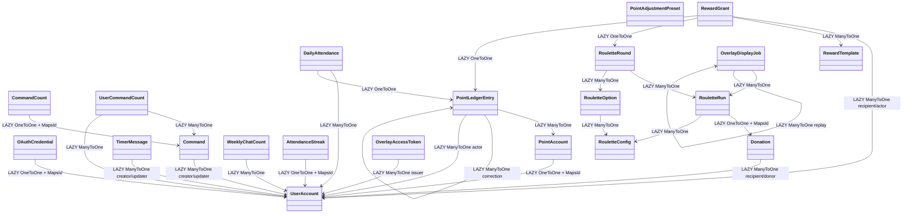

# Canonical database redesign

이 문서는 `nyang-nyang-bot`의 레거시 없는 최종 데이터 모델과 마이그레이션 경계를 정의한다.
실행 가능한 Flyway 마이그레이션은 아직 만들지 않았으며, 최종 물리 스키마 명세는
[`target-schema.sql`](./target-schema.sql), MariaDB 불변성 명세는
[`target-invariants.sql`](./target-invariants.sql), 현행 DB 사전점검 쿼리는
[`migration-preflight.sql`](./migration-preflight.sql)을 기준으로 한다.

## 확정 원칙

- 최종 업무 테이블은 21개이며 기존 `favorite`, `upbo`, `roulette_event`,
  `authorization_account` 명칭을 남기지 않는다.
- `user_account.user_id`는 CHZZK 사용자 식별자 자체를 PK로 사용한다.
- 사용자 ID는 공백 제거·대소문자 변환 없이 원문 바이트를 보존하고, 뒤 공백도
  구분하는 `utf8mb4_nopad_bin`으로 비교한다. 서로 다른 원문이 trim/case/Unicode collation에서만
  같아지는 경우 자동 병합하지 않고 컷오버를 중단한다.
- 단일 부모와 생명주기를 공유하는 1:1 상태는 shared PK를 사용한다.
- 복합 업무키가 필요한 독립 행은 `BIGINT` PK와 업무 `UNIQUE`를 함께 둔다.
- 모든 FK는 Flyway DDL이 소유한다. JPA는 자식에서 부모로 향하는 단방향
  `LAZY` ToOne만 사용하며 `@OneToMany`, `@ManyToMany`, `CascadeType`,
  `orphanRemoval`을 두지 않는다.
- 룰렛 설정과 옵션은 활성화 이후 불변이다. 변경은 새 `roulette_config`와
  `roulette_option` 집합을 생성해 교체한다.
- MariaDB trigger가 non-DRAFT 룰렛 설정/옵션의 UPDATE·DELETE와 포인트 원장의
  UPDATE·DELETE를 차단하고 run/round의 설정·추첨 사실과 삭제를 보호한다.
  애플리케이션 검증만으로 불변성을 주장하지 않는다.
- `roulette_run`과 `roulette_round`에는 설정/옵션 JSON 또는 표시값 스냅샷을
  저장하지 않는다.
- OAuth access/refresh token은 현재 결정대로 평문 저장한다. 애플리케이션 로그,
  API 응답, 예외 메시지에는 절대 노출하지 않는다.
- 모든 테이블과 컬럼 설명은 실제 DB `COMMENT`로 관리한다. 별도 `description`
  컬럼은 업무 데이터일 때만 사용한다.
- 카운트 초기화는 운영자가 DB에서 수행한다. 카운트 관리 화면과 초기화 이력은
  이번 모델에 포함하지 않는다.

## 21개 테이블

| 영역 | 테이블 | 역할 |
|---|---|---|
| 사용자 | `user_account` | 공통 CHZZK 사용자, 현재 표시 이름, 관리자 여부 |
| 인증 | `oauth_credential` | 사용자별 OAuth 자격 증명 |
| 명령 | `command` | 사용자 정의 채팅 명령 |
| 명령 | `command_count` | 명령별 전체 실행 수 |
| 명령 | `user_command_count` | 명령·사용자별 실행 수 |
| 타이머 | `timer_message` | 타이머 설정과 원자적 선점 상태 |
| 포인트 | `point_account` | 사용자별 현재 잔액 |
| 포인트 | `point_ledger_entry` | 불변 포인트 원장 |
| 포인트 | `point_adjustment_preset` | 관리자 조정 프리셋 |
| 채팅 | `weekly_chat_count` | 서울 기준 주간 채팅 집계 |
| 출석 | `daily_attendance` | 일별 출석 사실 |
| 출석 | `attendance_streak` | 현재·최장 연속 출석 캐시 |
| 후원 | `donation` | CHZZK 후원 원본 이벤트 |
| 룰렛 | `roulette_config` | 불변 룰렛 설정 버전 |
| 룰렛 | `roulette_option` | 설정 버전에 속한 불변 옵션 |
| 룰렛 | `roulette_run` | 후원당 하나의 룰렛 실행 |
| 룰렛 | `roulette_round` | 실행의 개별 추첨 회차 |
| 보상 | `reward_template` | 반복 사용 가능한 보상 정의 |
| 보상 | `reward_grant` | 사용자에게 실제 지급된 보상 |
| 오버레이 | `overlay_access_token` | 원문을 저장하지 않는 접근 토큰 해시 |
| 오버레이 | `overlay_display_job` | 원자적으로 선점하는 표시 작업 |

## 물리 DB 관계도

아래 다이어그램은 FK 방향과 주요 키만 표시한다. 전체 컬럼, 타입, 인덱스,
CHECK와 삭제 규칙은 `target-schema.sql`이 기준이다.

```mermaid
erDiagram
    USER_ACCOUNT {
        varchar user_id PK
    }
    OAUTH_CREDENTIAL {
        varchar user_id PK, FK
    }
    COMMAND {
        bigint id PK
        varchar created_by_user_id FK
        varchar updated_by_user_id FK
    }
    COMMAND_COUNT {
        bigint command_id PK, FK
    }
    USER_COMMAND_COUNT {
        bigint id PK
        bigint command_id FK
        varchar user_id FK
    }
    TIMER_MESSAGE {
        bigint id PK
        varchar created_by_user_id FK
        varchar updated_by_user_id FK
    }
    POINT_ACCOUNT {
        varchar user_id PK, FK
    }
    POINT_LEDGER_ENTRY {
        bigint id PK
        varchar user_id FK
        bigint correction_of_entry_id FK
        varchar actor_user_id FK
    }
    POINT_ADJUSTMENT_PRESET {
        bigint id PK
    }
    WEEKLY_CHAT_COUNT {
        bigint id PK
        varchar user_id FK
    }
    DAILY_ATTENDANCE {
        bigint id PK
        date attendance_date UK
        varchar user_id FK
        bigint point_ledger_entry_id FK
    }
    ATTENDANCE_STREAK {
        varchar user_id PK, FK
        date last_attendance_date FK
    }
    DONATION {
        bigint id PK
        varchar recipient_user_id FK
        varchar donor_user_id FK
    }
    ROULETTE_CONFIG {
        bigint id PK
    }
    ROULETTE_OPTION {
        bigint id PK
        bigint roulette_config_id FK
    }
    ROULETTE_RUN {
        bigint donation_id PK, FK
        bigint roulette_config_id FK
    }
    ROULETTE_ROUND {
        bigint id PK
        bigint roulette_run_id FK
        bigint roulette_config_id FK
        bigint roulette_option_id FK
    }
    REWARD_TEMPLATE {
        bigint id PK
    }
    REWARD_GRANT {
        bigint id PK
        varchar user_id FK
        bigint reward_template_id FK
        bigint roulette_round_id FK
        bigint point_ledger_entry_id FK
        varchar actor_user_id FK
    }
    OVERLAY_ACCESS_TOKEN {
        bigint id PK
        varchar issued_by_user_id FK
    }
    OVERLAY_DISPLAY_JOB {
        bigint id PK
        bigint roulette_run_id FK
        bigint replay_of_job_id FK
    }

    USER_ACCOUNT ||--o| OAUTH_CREDENTIAL : owns
    USER_ACCOUNT o|--o{ COMMAND : creates_or_updates
    COMMAND ||--o| COMMAND_COUNT : has_total
    COMMAND ||--o{ USER_COMMAND_COUNT : has_user_counts
    USER_ACCOUNT ||--o{ USER_COMMAND_COUNT : accumulates
    USER_ACCOUNT o|--o{ TIMER_MESSAGE : creates_or_updates
    USER_ACCOUNT ||--o| POINT_ACCOUNT : owns
    POINT_ACCOUNT ||--o{ POINT_LEDGER_ENTRY : records
    USER_ACCOUNT o|--o{ POINT_LEDGER_ENTRY : acts
    POINT_LEDGER_ENTRY o|--o| POINT_LEDGER_ENTRY : corrects
    USER_ACCOUNT ||--o{ WEEKLY_CHAT_COUNT : chats
    USER_ACCOUNT ||--o{ DAILY_ATTENDANCE : attends
    POINT_LEDGER_ENTRY ||--o| DAILY_ATTENDANCE : pays
    USER_ACCOUNT ||--o| ATTENDANCE_STREAK : caches
    DAILY_ATTENDANCE ||--o| ATTENDANCE_STREAK : anchors_latest
    USER_ACCOUNT ||--o{ DONATION : receives
    USER_ACCOUNT o|--o{ DONATION : donates
    ROULETTE_CONFIG ||--o{ ROULETTE_OPTION : defines
    DONATION ||--o| ROULETTE_RUN : starts
    ROULETTE_CONFIG ||--o{ ROULETTE_RUN : executes_with
    ROULETTE_RUN ||--o{ ROULETTE_ROUND : contains
    ROULETTE_OPTION ||--o{ ROULETTE_ROUND : selects
    USER_ACCOUNT ||--o{ REWARD_GRANT : receives
    REWARD_TEMPLATE o|--o{ REWARD_GRANT : originates_from
    ROULETTE_ROUND o|--o| REWARD_GRANT : grants
    POINT_LEDGER_ENTRY o|--o| REWARD_GRANT : converts_to
    USER_ACCOUNT o|--o{ REWARD_GRANT : manually_grants
    USER_ACCOUNT o|--o{ OVERLAY_ACCESS_TOKEN : issues
    ROULETTE_RUN ||--o{ OVERLAY_DISPLAY_JOB : displays
    OVERLAY_DISPLAY_JOB o|--o{ OVERLAY_DISPLAY_JOB : replays
```

## JPA 엔티티 관계도

부모 엔티티에는 자식 컬렉션을 만들지 않는다. 목록·집계 화면은 repository
projection, 명시적 join 또는 fetch join으로 읽는다.

Shared PK `@MapsId`는 정확히 다섯 곳이다.

1. `OAuthCredential.userId -> UserAccount.userId`
2. `CommandCount.commandId -> Command.id`
3. `PointAccount.userId -> UserAccount.userId`
4. `AttendanceStreak.userId -> UserAccount.userId`
5. `RouletteRun.donationId -> Donation.id`

`UserCommandCount`, `WeeklyChatCount`, `DailyAttendance`는 복합 PK를 사용하지
않는다. 각각 `BIGINT id`를 PK로 두고 `(command_id, user_id)`,
`(week_start_date, user_id)`, `(attendance_date, user_id)`를 `UNIQUE`로 보존한다.

`RouletteRound.rouletteConfigId`는 scalar로 한 번만 쓰기 가능하게 매핑하고,
`rouletteRun`은 `roulette_run_id`, `rouletteOption`은 `roulette_option_id` 하나로
각 전역 유일 PK를 참조한다. `PointLedgerEntry.correction`은
`correction_of_entry_id`, `RewardGrant.pointLedgerEntry`는
`point_ledger_entry_id`, `OverlayDisplayJob.replay`는 `replay_of_job_id`만 소유한다.
각 엔티티의 사용자/run 연관이 `user_id`/`roulette_run_id`를 따로 소유하며,
Hibernate 7에서 한 컬럼을 writable/read-only `@JoinColumns`로 섞지 않는다. 물리
DDL의 복합 FK만 same-user, same-config, same-run 무결성을 추가로 보장한다.

`AttendanceStreak.lastAttendanceDate`는 scalar로 두고 `DailyAttendance` 연관은
JPA에 만들지 않는다. `(last_attendance_date, user_id)` 물리 FK가 최신 출석 사실의
존재만 강제한다. 생성 컬럼 `active_slot`도 JPA 필드로 매핑하지 않는다.
`DailyAttendance.pointLedgerEntry`는 `point_ledger_entry_id`만으로 매핑하고,
동일 사용자 복합 FK는 Flyway가 소유한다.

`OAuthCredential.credentialVersion`에는 반드시 `@Version`을 붙인다. 토큰 refresh
충돌은 `OptimisticLockException`을 무시하거나 last-write-wins로 처리하지 않고,
최신 credential을 다시 읽은 뒤 제한된 횟수만 재시도한다.

Hibernate type 추론에 맡기지 않는 컬럼은 다음처럼 명시한다.

- OAuth의 access/refresh/scope는 `@JdbcTypeCode(SqlTypes.LONGVARCHAR)`와 각각
  `columnDefinition="TEXT"`를 사용한다.
- `Donation.message`는 `@JdbcTypeCode(SqlTypes.LONGVARCHAR)`와
  `columnDefinition="LONGTEXT"`를 사용한다.
- `OverlayAccessToken.tokenHash`는 `length=43`,
  `columnDefinition="CHAR(43)"`로 고정한다.
- claim token은 UUID 객체 자동 추론을 사용하지 않고 길이 36의 `String`으로 매핑한다.

이 매핑도 MariaDB `ddl-auto=validate`의 검증 대상이다.

## 제약과 배포 운영 규칙

Flyway DDL을 애플리케이션과 DB 사이의 계약 원본으로 사용한다. 코드 enum만 먼저
추가하면 CHECK에서 실패하는 것이 의도된 동작이다. 새 값을 배포할 때는 호환 가능한
Flyway 제약 확장, 새 코드 배포, 구값 제거가 필요하면 후속 축소 migration 순으로
진행한다. 운영자가 자주 추가하는 분류로 바뀌면 CHECK enum을 계속 늘리지 않고 별도
참조 테이블로 승격한다.

사람이 읽는 이름과 본문은 `utf8mb4_unicode_ci`, 식별자와 machine enum/status는
`utf8mb4_nopad_bin`을 사용한다. 따라서 `READY`, `ready`, `READY `는 서로 다른 값이고
CHECK는 정본 대문자만 허용한다. legacy enum 사전점검도 `BINARY` 비교를 사용한다.

삭제 규칙은 다음 범위로 제한한다.

- `CASCADE`는 shared-PK OAuth, command count, 사용자별 집계·streak처럼 부모 없이
  의미가 없거나 재계산 가능한 행, 그리고 DRAFT config의 option에만 사용한다.
- `SET NULL`은 명령/타이머 작성자, 후원자, 보상 템플릿, 토큰 발급자처럼 본문을
  보존하면서 선택적 참조만 끊어도 되는 관계에만 사용한다.
- 원장, 출석 사실, 후원, READY run/round, 지급 보상, overlay 이력은 `RESTRICT`와
  불변성 trigger로 보호한다.
- JPA cascade와 orphan removal은 사용하지 않는다. 삭제 서비스는 영향 행을 먼저
  조회하고 명시적으로 처리하며 FK 위반을 일관된 업무 오류로 변환한다.

CI에서는 Flyway를 빈 MariaDB에 전부 적용한 뒤 Hibernate `ddl-auto=validate`와
삭제 규칙·enum 호환성 통합 테스트를 실행한다.

## 불필요 컬럼 재점검 결과

### 제거 또는 대체

| 현행 항목 | 최종 처리 | 이유 |
|---|---|---|
| `authorization_account`의 사용자·토큰 혼합 | `user_account`와 `oauth_credential`로 분리 | 사용자 생명주기와 비밀정보 경계 분리 |
| `expires_in + modify_date` | `access_token_expires_at` | 만료 판단을 절대 시각 하나로 표현 |
| 모든 `favorite_*` 이름 | `point_*` | 실제 도메인이 즐겨찾기가 아닌 포인트 |
| `favorite_history.history` | `point_ledger_entry.description` | `public_description`과 중복 |
| `favorite_history.favorite` | `point_ledger_entry.balance_after` | 동일 잔액 중복 |
| `favorite_history.display_category` | 제거 | `source_type`으로 결정 가능 |
| 포인트·주간·보상의 닉네임 스냅샷 | 제거 | 현재 이름은 `user_account`, 사건 당시 이름은 후원에만 유지 |
| 공통 `modify_date` | 상태가 실제 변하는 테이블에만 `updated_at` 유지 | 불변 원장·집계 행의 무의미한 수정 시각 제거 |
| `subscription` 전체 | 제거 | Java 사용처가 없는 레거시; 데이터가 있으면 컷오버 차단 |
| `donation.emojis_json` | 제거 | 저장 후 읽는 경로가 없음 |
| `roulette_table.version` | 제거 | 옵션 변경과 동기화되지 않아 버전 증거가 아님 |
| `roulette_item.active`, 수정 시각 | 제거 | 옵션은 설정 버전 내부에서 불변 |
| `roulette_event`의 사용자·후원·설정 복제와 JSON | `donation`, `roulette_config` FK로 대체 | 같은 사실을 여러 곳에 저장하지 않음 |
| `roulette_event.round_count` | 제거 | 확정된 `roulette_round` 수로 계산 |
| `roulette_round_result`의 옵션 표시값·보상값 스냅샷 | `roulette_option_id` FK로 대체 | 옵션 불변성을 전제로 원본 참조 |
| 라운드의 `ledger_id`, `user_upbo_id` | `reward_grant`의 유일 FK로 이동 | 보상 지급이 연결의 소유자 |
| `upbo_*` 이름 | `reward_*` | 보편적인 보상 도메인 명칭 |
| `RewardType.FAVORITE` 값 | `POINT`로 변환 | 새 코드·DB에 레거시 명칭을 남기지 않음 |
| `overlay_token.active` | `revoked_at`과 생성 `active_slot`으로 대체 | 같은 상태의 이중 표현 제거 |
| `overlay_display_event.fetched_at` | claim token/만료 lease로 대체 | 시간 기록만으로는 원자적 선점을 보장하지 못함 |

### 의도적으로 유지한 값

| 컬럼 | 유지 이유 |
|---|---|
| `user_account.display_name` | 현재 프로필 표시와 사용자 검색 |
| `donation.donor_display_name` | 사용자 프로필이 아닌 후원 사건 당시 원문 |
| `oauth_credential.scope` | 발급된 권한 범위 감사와 권한 축소 감지 |
| `oauth_credential.credential_version` | 동시에 발생한 refresh의 stale token 덮어쓰기 방지 |
| `command_count.count_value` | 사용자별 행을 합산하지 않고 전체 카운트를 원자적으로 증가·렌더링 |
| `timer_message.claimed_chat_count` | 전송 중 새로 들어온 채팅 수를 잃지 않고 차감 |
| `point_account.balance` | hot path 현재 잔액 조회와 잠금 갱신 |
| `point_ledger_entry.balance_after` | 원장 재조정과 사용자 이력 표시 |
| `point_ledger_entry.source_reference` | 외부 사건·업무 요청과 원장 항목의 추적 연결 |
| `point_ledger_entry.private_note` | 사용자 설명과 분리된 관리자 감사 메모 |
| `attendance_streak`의 세 상태값 | 매 출석 시 전체 이력을 재계산하지 않는 일관된 캐시 |
| `roulette_config.active_slot` | 한 개의 ACTIVE 설정만 허용하는 비저장 생성 컬럼 |
| `roulette_run.status` | `BUILDING -> READY`로 회차 집합을 한 번 확정하고 늦은 회차 추가를 차단 |
| `roulette_round.roulette_config_id` | run과 option이 같은 설정 버전인지 두 복합 FK로 강제 |
| `roulette_round.ticket` | 확률 구간과 선택 결과를 사후 검증하는 추첨 증거 |
| `reward_grant`의 label/type/mode/point 값 | 템플릿 없는 수동 지급도 지원하는 실제 지급 사실 |
| `overlay_display_job.replay_of_job_id` | 재표시 계보를 보존하며 복합 self FK로 같은 run만 허용 |
| `overlay_display_job.idempotency_key` | enqueue 재시도의 중복 작업 생성 방지 |
| `overlay_display_job.displayed_at` | 최종 표시 완료 시각과 DISPLAYED 상태의 일치 검증 |

`attendance_streak.total_attendance_days`는 두지 않는다. 전체 출석일 수는
`daily_attendance`의 행 수로 계산할 수 있고 streak 갱신에는 필요하지 않다.
오버레이 토큰에도 현재 정책에 없는 `expires_at`을 새로 추가하지 않는다.

## DB가 보장하는 핵심 무결성

- 모든 사용자 참조는 `user_account` FK다. 시스템 수행은 가짜 사용자 행이 아니라
  nullable actor FK의 `NULL`로 표현한다.
- 카운터와 잔액은 음수 정책에 맞는 CHECK를 사용한다. 포인트 잔액은 현행 정책상
  음수가 가능하므로 `balance >= 0` 제약을 두지 않는다.
- 포인트 정정의 same-user 복합 FK와 UNIQUE는 같은 사용자의 원장 항목을 한 번만
  정정하게 한다.
  자기 자신 정정은 MariaDB가 AUTO_INCREMENT 컬럼을 CHECK에서 참조할 수 없으므로
  application policy와 migration preflight가 차단한다.
- 주간 집계 시작일은 `DAYOFWEEK(...)=2`로 월요일만 허용한다.
- streak의 `(last_attendance_date, user_id)` 복합 FK는 캐시가 동일 사용자의 실제
  `daily_attendance` 행을 가리키게 한다. 그 날짜가 사용자의 최대 출석일이고
  current/longest 값이 전체 이력과 일치하는지는 출석 서비스의 동일 트랜잭션과 V9
  재계산 검증이 보장한다.
- 일별 출석은 동일 사용자의 `ATTENDANCE` 원장 한 건을 반드시 참조하고,
  `attendance_date = DATE(attended_at)`를 만족한다. insert trigger가 원장 source를
  확인하고 이후 attendance UPDATE·DELETE를 차단한다.
- 활성 룰렛 설정과 폐기되지 않은 오버레이 토큰은 생성 컬럼 UNIQUE로 각각 하나만
  허용한다.
- 룰렛 회차의 두 복합 FK가 실행 설정과 옵션 설정의 동일성을 보장한다.
- 룰렛 run은 `BUILDING`일 때 CONFIRMED round만 추가할 수 있고, 하나 이상의 round가
  모두 생성된 뒤에만 `READY`로 한 번 전환한다. 이후 round 추가와 run 변경은 차단한다.
  전체 처리 결과는 중복 캐시하지 않고 round 상태를 집계해 계산한다.
- 보상과 포인트 원장의 복합 FK는 보상 수령자와 원장 계정 사용자의 동일성을
  보장한다.
- 룰렛 확률 합계 10000과 활성화 이후 불변성은 행간 규칙이므로 활성화 서비스의
  단일 트랜잭션, MariaDB trigger 및 회귀 테스트가 함께 보장한다.
- donation은 insert 이후 UPDATE·DELETE하지 않는다. reward grant는 지급 사실을
  고정하고 `OWNED -> USED`, `CONVERTED -> CORRECTED`만 허용한다.
- overlay access token의 발급 사실은 고정하고 `revoked_at`은 NULL에서 시각 값으로
  한 번만 바뀐다. display job은 enqueue 사실을 고정하고 PENDING/DISPLAYING에서만
  정해진 전이를 허용하며 DISPLAYED/MISSED는 terminal이다.
- 오버레이 replay의 복합 self FK는 같은 `roulette_run_id`의 기존 작업만 가리킨다.
  자기 자신 replay는 application policy와 migration preflight가 차단한다.
- `DISPLAYING` 작업만 claim token/만료 시각을 가지며, `DISPLAYED` 작업만
  `displayed_at`을 가진다.

## 현재 스키마에서 최종 스키마로의 매핑

| 현재 | 최종 | 핵심 변환 |
|---|---|---|
| `authorization_account` | `user_account`, `oauth_credential` | 사용자·관리자·로그인 시각 분리, 만료 절대시각 계산 |
| `command` | `command` | actor의 `system`은 NULL, `{favorite.balance}`는 `{point.balance}`로 변환 |
| 없음 | `command_count`, `user_command_count` | 빈 테이블로 시작 |
| `timer_message` | `timer_message` | 시스템 actor NULL, 선점 상태 검증 |
| `favorite_account` | `point_account` | `favorite -> balance`, 닉네임 제거 |
| `favorite_history` | `point_ledger_entry` | 중복 컬럼 제거, source enum과 참조 이름 변환 |
| `favorite_adjustment` | `point_adjustment_preset` | 금액을 BIGINT로 확대 |
| `weekly_chat_rank` | `weekly_chat_count` | 닉네임·공통 시각 제거 |
| `favorite_history(ATTENDANCE)` | `daily_attendance`, `attendance_streak` | 서울 로컬 일자별 출석 사실과 연속 일수 복원 |
| `donation` | `donation` | 표준 이름, 사용자 FK, emoji·수정 시각 제거 |
| `roulette_table`, `roulette_item` | `roulette_config`, `roulette_option` | 현재 설정을 불변 버전으로 물질화 |
| `roulette_event.items_snapshot_json` | 이벤트별 ARCHIVED config/options | 과거 실행에 한해 JSON을 한 번 파싱한 뒤 JSON은 폐기 |
| `roulette_event` | `roulette_run` | donation/config FK와 회차 구성 생명주기만 유지; 처리 상태는 round에서 파생 |
| `roulette_round_result` | `roulette_round` | 이벤트 snapshot option에 정확히 매핑되는 FK 생성 |
| `upbo_template` | `reward_template` | `FAVORITE -> POINT`, 표준 이름 |
| `user_upbo` | `reward_grant` | 사용자·템플릿·round·ledger FK와 실제 지급 사실 |
| `overlay_token` | `overlay_access_token` | active를 revoked_at으로 단일화, hash 형식 검증 |
| `overlay_display_event` | `overlay_display_job` | 원자적 claim lease와 deterministic idempotency key 추가 |
| `subscription` | 없음 | 행이 있으면 자동 폐기하지 않고 컷오버를 중단 |

과거 룰렛 행을 현재 mutable `roulette_item`에 직접 연결하면 안 된다. 각
`roulette_event.items_snapshot_json`을 Java Flyway migration에서 파싱해 해당 실행의
ARCHIVED config/options를 만들고, `ticket`과 당시 옵션 순서·값을 이용해 각 라운드가
정확히 하나의 옵션에 매핑되는지 검증한다. 하나라도 모호하거나 불일치하면 파괴적
컷오버 전에 실패해야 한다.

`roulette_event`와 `donation`에 중복 저장된 donor ID, 표시 이름, 금액, 본문은
preflight에서 NULL-safe binary 비교로 동일함을 먼저 증명한 뒤 `donation`만 정본으로
남긴다.
일반 donation의 donor는 익명일 수 있지만 roulette run은 식별된 donor가 있을 때만
생성한다. 기존 roulette event의 donation donor가 NULL/blank면 컷오버를 차단하고,
새 처리 경로도 익명 후원은 룰렛 대상에서 제외한다.
`user_upbo.source_type`은 `UPBO_MANUAL -> MANUAL`,
`UPBO_ROULETTE -> ROULETTE`로 변환하며, 룰렛 보상은 정확히 하나의 기존 round와
연결돼야 한다. target에는 모호한 source를 숨기는 fallback enum을 두지 않는다.

보상 백필은 `public_description -> description`,
`exchange_favorite_value -> point_delta`로 옮기고 idempotency key를
`legacy-reward-grant:<user_upbo.id>`로 생성한다. `UPBO_MANUAL` actor는 정확한
`user_account` FK여야 하고, 룰렛의 `SYSTEM` actor는 `NULL`로 바꾼다. AUTO 보상은
동일 사용자의 원장과 delta/source가 일치해야 하며, 룰렛 보상 사용자는 donation의
식별된 donor와 일치해야 한다.

포인트 원장은 trim한 `public_description`의 nonblank 값을 우선하고, 없을 때만
trim한 `history`를 `description`으로 사용한다. `UPBO_MANUAL -> REWARD_MANUAL`,
`UPBO_ROULETTE -> REWARD_ROULETTE`로 source enum을 바꾸고 다른 source는 유지한다.
모든 사용자의 첫 행은 `0 + delta = balance_after`, 이후 행은 직전
`balance_after + delta = balance_after`를 만족해야 한다.

과거 이벤트 전용 config는 title을 `Legacy roulette event #<event-id>`,
trigger token과 가격을 이벤트의 `command`, `price_per_round`, 고회차 기준을 결과에
영향을 주지 않는 고정값 `100`으로 만든다. 이벤트 command/price가 목표 제약을
만족하지 않으면 물질화하지 않고 중단한다.

과거 `items_snapshot_json`은 새 runtime DTO/enum으로 역직렬화하지 않는다. V8_1의
격리된 migration adapter가 `JsonNode`/raw string으로 읽어 legacy `FAVORITE`를
target `POINT`로 명시 변환하고, 꽝 옵션의 `NONE + null point_delta`, 확률, 순서,
필수 필드를 현재 옵션과 동일하게 검증한다. legacy 문자열은 이 migration 전용
adapter에서만 허용하며 V10 이후 runtime 코드와 최종 DB 값에는 남기지 않는다.
기존 `conversion_mode=NONE`의 `exchange_favorite_value`가 NULL 또는 0이면 둘 다
의미 없는 값으로 간주해 target NULL로 정규화하고, 0이 아닌 값은 중단한다.

기존 `roulette_event.round_count`는 버리기 전에 `donation_amount / price_per_round`의
정수 나눗셈 결과와 같고, 실제 round 행이 정확히 그 수만큼 있으며 `round_no`가
1부터 끊김 없이 이어지는지 검증한다. 세 조건 중 하나라도 다르면 누락 회차를
추정 생성하지 않고 컷오버를 중단한다.

현재 `roulette_table/item`은 active table을 `ACTIVE`, 나머지 table을 `ARCHIVED`로
옮긴다. 현행 코드에 option 비활성화 경로가 없으므로 `roulette_item.active=FALSE`는
정상적으로 0건이어야 한다. 한 건이라도 있으면 option을 조용히 버리거나 다시
활성화하지 않고 preflight를 중단해 별도 보존 결정을 받는다.

`overlay_token.active=TRUE`는 `revoked_at=NULL`로, 비활성 토큰은
`revoked_at=COALESCE(revoked_at, modify_date, create_date)`로 변환한다. 이 규칙으로
비활성 토큰이 다시 활성화되거나 여러 NULL active slot을 만드는 일을 막는다.
`overlay_display_job.idempotency_key`는
`legacy-overlay-display:<overlay_display_event.id>`로 생성한다. 기존 PK가 유일하므로
충돌이 없고 replay는 `replay_of_display_event_id < id`를 만족하는 ID 오름차순으로
삽입한다.

기존 `favorite_history.source_type=ATTENDANCE` 행은 `create_date`를 Asia/Seoul의
로컬 `DATETIME`으로 해석해 `DATE(create_date)`를 출석일로 사용한다. 같은 사용자와
날짜에 둘 이상이면 임의 합치지 않고 preflight를 중단한다. 유일한 행은
해당 원장 ID를 참조하는 `daily_attendance`로 모두 보존하고 전체 일자 집합으로 current/longest streak를
계산한다. 따라서 컷오버 당일 이미 존재하는 출석은 UNIQUE와 업무 idempotency로
재지급되지 않는다.

`user_account` 백필은 모든 사용자 ID 후보를 합친 후 다음 순서로 결정한다.

- `created_at`: 후보의 가장 이른 non-null 관측 시각, 관측 시각이 전혀 없으면
  V8이 한 번 캡처한 cutover 시각
- `updated_at`: 후보의 가장 늦은 non-null 관측 시각, 없으면 `created_at`
- `display_name`: 관측 시각 내림차순, 동률이면 authorization, point account,
  weekly chat, donation, roulette event, reward 순; 그 뒤 source row ID 내림차순과
  binary 이름 오름차순으로 하나를 선택
- `is_admin`, `last_login_at`: `authorization_account` 값만 사용

preflight는 동일 user ID의 이름 충돌과 대소문자만 다른 ID를 별도 목록으로
출력한다. 사용자 ID는 절대 trim/case-fold하지 않으며 equivalence collision이 한
건이라도 있으면 운영자가 정본 ID를 결정할 때까지 중단한다. 구현자가 임의의
INSERT 순서에 의존해서 이름을 선택하면 안 된다.

### 백필 ID와 시각 규칙

1:1로 대응하는 기존 surrogate ID는 그대로 보존한다. 대상은 `command`,
`timer_message`, `point_ledger_entry`, `point_adjustment_preset`,
`weekly_chat_count`, `donation`, 현재 `roulette_config/option`, `roulette_round`,
`reward_template/grant`, `overlay_access_token/display_job`이다. 따라서 correction과
replay는 대상 ID보다 작은 기존 ID만 참조하도록 preflight에서 강제하고 ID 오름차순으로
부모부터 삽입한다.

`roulette_event.id`는 target PK가 아니다. V8_1은 임시
`migration_roulette_event_map(old_event_id, donation_id, roulette_config_id)`와
`migration_roulette_option_map(old_event_id, option_ordinal, roulette_option_id)`를
만들어 run/config/option을 연결한다. 현재 config/option ID를 먼저 명시 삽입하고
AUTO_INCREMENT를 최대값 다음으로 맞춘 뒤 과거 이벤트 전용 config/options를 생성한다.
V8_2가 bridge로 reward와 overlay FK를 채운 후 V10이 bridge와 모든 레거시 테이블을
제거한다. 모든 명시 ID 삽입이 끝난 테이블은 `AUTO_INCREMENT = MAX(id)+1`을 검증한다.

사건·원장·보상처럼 의미 있는 target `created_at`은 source `create_date`가 반드시
있어야 하며 preflight가 NULL을 차단한다. 변경 가능한 행의 `updated_at`은
`COALESCE(modify_date, create_date)`다. 관측 시각이 없는 user 후보만 V8 시작 시 한 번
고정한 cutover 시각을 사용한다. 암묵적 column DEFAULT로 과거 사건 시각을 채우지
않는다.

## 적용 순서

기존 `V1`~`V6`는 이미 적용된 checksum이므로 수정하지 않는다. 운영 쓰기를 멈춘
maintenance window에서 다음 단계로 진행한다.

1. `V7__create_canonical_shadow_schema.sql`
   - `next_*` 이름으로 목표 21개 테이블, FK, 인덱스, CHECK, COMMENT 생성
   - `target-invariants.sql`과 같은 trigger를 `next_*` 테이블과 `trg_next_*` 이름으로 생성
2. `V8__backfill_canonical_data.sql`
   - 사용자 union, OAuth, command, timer, point, weekly, donation,
     attendance/streak, reward template, overlay access token의 독립적인 SQL 백필
3. `V8_1__materialize_roulette_history.java`
   - 현재 `roulette_table/item`을 불변 config/options로 옮기고, 과거 JSON을
     파싱해 이벤트별 ARCHIVED config/options, run, round를 순서대로 물질화
   - 과거 이벤트 config마다 DRAFT insert → option insert → ACTIVE → BUILDING run →
     CONFIRMED round insert → READY run → ARCHIVED를 순차 수행
   - 현행 활성 config는 모든 과거 실행을 옮긴 뒤 마지막에 ACTIVE로 전환
   - source `roulette_event.status`는 옮기지 않고 round 상태를 처리 상태의 정본으로 사용
4. `V8_2__backfill_roulette_dependents.sql`
   - 생성된 round/run FK를 사용해 reward grant를 먼저 백필
   - READY run의 round를 기존 APPLIED/FAILED로 전환한 뒤 overlay display job 백필
   - migration은 신뢰된 이력 복원 경로이므로 기존 terminal reward/job 상태와 원래
     시각을 INSERT에서 직접 보존한다. runtime 신규 job 생성은 항상 PENDING이다.
5. `V9__validate_canonical_backfill.java`
   - 기대/실제 행 수, orphan, enum, 원장 전 구간, 출석 streak, 룰렛 상태·보상 매핑,
     COMMENT와 제약을 검증하고 불일치 시 중단
   - 룰렛 round와 reward grant의 label/type/conversion/value 지급 사실을 NULL-safe
     binary 비교하고 `NONE`의 0/NULL은 target NULL로 정규화한 뒤 비교
6. `V10__cutover_canonical_schema.sql`
   - 애플리케이션 정지 상태에서 `trg_next_*`를 제거하고 원자적 rename 수행
   - 최종 테이블명으로 `target-invariants.sql` trigger를 새로 만든 뒤
     `SHOW CREATE TRIGGER`와 ACTIVE 전환 smoke test 수행
   - 검증 후 bridge와 레거시 테이블 제거
7. 새 JPA 모델로 시작하고 Hibernate `ddl-auto=validate` 수행

shadow schema를 쓰므로 백필/검증 실패는 기존 운영 테이블을 파괴하지 않는다.
`V10`은 복구 검증된 백업, 사전점검 0건, 애플리케이션 쓰기 중지라는 세 조건이
모두 충족됐을 때만 실행한다.

## 구현 영향 범위

- `authorization` 영속 모델을 `user`와 `oauth`로 분리한다.
- OAuth refresh는 `@Version` optimistic lock으로 보호하고 충돌 재시도 상한을 둔다.
- 공통 `ObserveUser`/user upsert 경계를 만들고 weekly chat, point account,
  command user count, attendance, donation, reward 저장 트랜잭션에서 자식보다 먼저
  `user_account`를 확보한다. nonblank 표시 이름만 최신 관측값으로 갱신한다.
- 내부 `favorite` 패키지·타입·변수 키를 `point`로, `upbo`를 `reward`로 바꾼다.
  사용자 화면에 노출된 한국어 표현과 URL은 별도 제품 결정 없이는 바꾸지 않는다.
- 저장된 command/timer template의 `{favorite.balance}`를 `{point.balance}`로
  백필하고 기존 변수 alias는 남기지 않는다.
- `RouletteTable/Item/Event/RoundResult`를
  `RouletteConfig/Option/Run/Round`로 교체하고 snapshot DTO/JSON 코드를 삭제한다.
- 명령 실행 경로에 atomic total/user counter upsert를 추가한다. preview와 timer
  rendering은 카운트를 증가시키지 않는다.
- 출석은 `Asia/Seoul`의 `LocalDate`로 일별 insert와 streak 갱신, 포인트 원장을
  한 트랜잭션에서 처리한다. 새 출석 원장의 idempotency key는
  `attendance:<yyyy-MM-dd>:<userId>`, source reference는 `<yyyy-MM-dd>`로 고정하고
  `daily_attendance.point_ledger_entry_id`에 연결한다.
- overlay claim은 조회 후 save가 아니라 조건부 update 또는 row lock으로 원자화하고,
  완료 요청에서 claim token까지 확인한다.
- generated `active_slot` 교체는 기존 행을 먼저 archive/revoke하는 bulk update를
  실행하고 flush한 다음 새 config/token을 activate/insert한다. Hibernate의 기본
  insert-before-dirty-update 순서에 맡기지 않는다.
- config 활성화와 option INSERT/UPDATE/DELETE는 항상 config PK를
  `PESSIMISTIC_WRITE`로 먼저 잠근다. option trigger도 `SELECT ... FOR UPDATE`로 같은
  부모를 직렬화하며, DB deadlock victim은 트랜잭션 전체를 제한적으로 재시도한다.
- 룰렛 실행은 식별된 donor와 ACTIVE config를 잠근 뒤 한 트랜잭션에서 BUILDING run,
  전체 CONFIRMED round, READY 전환 순으로 생성한다. reward 처리와 round 상태 전환은
  별도 원자 트랜잭션으로 수행한다. round trigger가 run PK를 잠가 READY 이후의 늦은
  round 추가와 READY 이전 처리를 막는다.
- 활성 overlay token 조회는 `(revoked_at, id)` 인덱스를 타는 `revoked_at IS NULL`
  query로 구현하고 실제 MariaDB 실행 계획을 확인한다.
- 기존 FK 0개를 요구하고 명시적 `@JoinColumn`을 금지하는 architecture/Flyway
  테스트는 목표 규칙에 맞게 교체한다.

## 완료 기준

- 정확히 21개 업무 테이블이며 최종 DB와 runtime 코드의 레거시
  테이블·컬럼·enum 문자열이 0개다. 격리된 V8_1 입력 변환 코드는 예외다.
- 모든 테이블과 컬럼의 `COMMENT`가 비어 있지 않다.
- 모든 FK 후보 orphan, 업무키 중복, target NOT NULL 위반이 0개다.
- 모든 포인트 원장 행의 전 구간 잔액 연속성과 현재 계정 잔액이 일치한다.
- 기존 ATTENDANCE 원장이 일별 출석으로 전부 보존되고 streak를 재계산해도 같은 값이다.
- 새 출석의 날짜/원장 idempotency와 동일 사용자 FK를 MariaDB 통합 테스트로 검증한다.
- 모든 룰렛 run은 READY이고 하나 이상의 round를 가지며, 전체 처리 상태 조회는 round
  집계 결과와 일치한다.
- 과거 모든 룰렛 round가 하나의 immutable option에 정확히 매핑된다.
- 모든 JPA ToOne은 명시적 `LAZY`이고 ToMany/cascade/orphanRemoval이 0개다.
- 동시 command count, 포인트 갱신, 출석 중복, timer claim, overlay claim 테스트가
  lost update와 중복 처리를 만들지 않는다.
- 동시 OAuth refresh 테스트가 stale token overwrite를 만들지 않는다.
- 룰렛 보상 사용자가 donation donor와 같고 AUTO 보상의 point delta·ledger user가
  같은지 application invariant와 V9가 검증한다.
- roulette run이 식별된 donation donor에 대해서만 존재하는지 V9가 검증한다.
- active roulette와 overlay token 교체 순서를 실제 MariaDB integration test로
  검증한다.
- non-DRAFT option/config 변경·삭제와 point ledger 변경·삭제가 trigger에서
  거부되는지 MariaDB 통합 테스트로 검증한다.
- DRAFT config를 참조한 run, round 없는 READY 전환, READY 이후 round 추가,
  READY 이전 round 처리와 run/round의 identity 변경·삭제가 trigger에서 거부되는지
  검증한다.
- option 변경과 DRAFT->ACTIVE가 경합하는 2-connection 테스트에서 늦은 option
  변경이 ACTIVE 뒤에 commit되지 않는지 검증한다.
- `REPEATABLE READ`에서 기존 스냅샷을 먼저 만든 트랜잭션도 option 확률의 최신
  커밋을 잠금 읽기로 확인하여 잘못된 config 활성화를 허용하지 않는지 2-connection
  테스트로 검증한다.
- H2 테스트 외에 MariaDB 10.11 Testcontainers에서 Flyway 전체 적용,
  generated column, CHECK, FK delete rule, COMMENT, rename/cutover를 검증한다.
- `./gradlew test`, `./gradlew bootJar`, `git diff --check`, 실제 MariaDB의
  `ddl-auto=validate`가 모두 성공한다.

## 명시적으로 남은 보안 부채

OAuth access/refresh token 평문 저장은 현재 요구에 따른 의도적 부채다. 이번
마이그레이션에서는 암호화 컬럼이나 converter를 추가하지 않는다. DB 계정 최소 권한,
백업 접근 통제, SQL/애플리케이션 로그 마스킹은 적용 전 필수 운영 조건으로 둔다.
